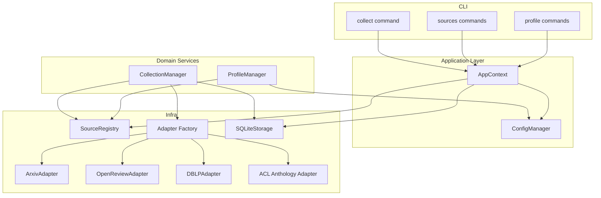

# Paper Agent v01_source Technical Design Doc

**Title:** Paper Agent v01_source Technical Design Doc (Source/Profile Extension)
**Version:** v01_source
**Status:** Draft
**Owner:** Paper Agent Team
**Last Updated:** 2026-03-12

## Related Documents
- Base Design (v01): `docs/v01/design.md`
- Base Requirement/Spec (v01): `docs/v01/requirement.md`, `docs/v01/spec.md`
- v01_source docs: [Requirements](./requirement.md), [Spec](./spec.md), [Feature](./feature.md), [MVP](./mvp.md)

---

**Document Positioning**

- This is an **incremental design** on top of v01.
- We reuse v01 layered architecture and local-first storage.
- Only new/changed components for Source/Profile are described here.

**Notation**
- 未确定方案统一标记为 `[待决策]`
- 事实或范围尚需进一步确认统一标记为 `[待确认]`

---

## 1. Architecture Delta（相对 v01 的增量）

### 1.1 New concepts

- **Profile**: a guided configuration layer producing `topics/keywords` and preferred sources.
- **Source Registry**: a first-class registry of sources with:
  - built-in definitions (checked-in `sources.yaml`)
  - user overrides (enabled/disabled + custom sources)
  - recommendation API

### 1.2 Why this fits v01 baseline

v01 already has:
- `Paper.source_name` + `Paper.canonical_key` for multi-source dedup
- `SQLiteStorage` with a unique constraint on `canonical_key`
- A service layer (`CollectionManager`) that can be generalized from a single adapter

Therefore, v01_source can be implemented as:
- **new adapters** + **adapter factory**
- **registry + config state machine**
- **minimal DB changes** (prefer none for MVP)

---

## 2. Component Design

### 2.1 C4 L3 Delta (Component Subgraph)

### 2.2 SourceRegistry

**Responsibilities**
- Load built-in source definitions from `paper_agent/infra/sources/sources.yaml`
- Merge a user override layer (enabled/disabled + custom sources)
- Expose APIs:
  - `list_sources()`
  - `get_source(id)`
  - `enable(ids)` / `disable(ids)`
  - `add_custom(source_def)`
  - `recommend(profile)`

**Data model (conceptual)**
- `SourceDefinition`:
  - `id`: stable string key, e.g. `arxiv:cs.AI`, `openreview:NeurIPS`, `dblp:conf/aaai`, `acl:ACL`
  - `type`: `arxiv_category | openreview_venue | dblp_venue | acl_venue | custom`
  - `display_name`
  - `collector`: which adapter to use
  - `params`: adapter-specific params

**Persistence**
- Built-in layer: repo file (read-only)
- User layer:
  - Option A: `~/.paper-agent/sources.yaml`
  - Option B: embed into `config.yaml`

`[待决策]` MVP should pick one; prefer **separate user sources.yaml** to avoid exploding config schema and keep overrides isolated.

### 2.3 ProfileManager

**Responsibilities**
- Provide a guided flow to produce:
  - `topics` (list[str])
  - `keywords` (list[str])
- Optionally call LLM for generation/refinement
- Ask SourceRegistry for recommended sources and persist user selection

**Integration points**
- Reuse existing LLM provider config and existing config store
- Write profile completion state for gating other flows

### 2.4 AdapterFactory + Adapters

**Adapter interface (informal)**
- `collect_papers(params...) -> list[Paper]`

MVP adapters:
- `ArxivAdapter` (already exists)
- `OpenReviewAdapter` (new)
- `DBLPAdapter` (new)
- `ACLAnthologyAdapter` (new)

**Key normalization rule**
- Set `Paper.source_name` and `Paper.canonical_key` per source (see spec).

---

## 3. Data Model / Storage Changes

### 3.1 Papers table

No changes required for MVP if adapters populate:
- `source_name`
- `canonical_key`
- `source_paper_id`

### 3.2 Collections table

Current v01 `collections` table tracks `source_name` and counts. For multi-source, we need per-run per-source breakdown.

Options:

- **Option A (minimal DB change)**: create one `CollectionRecord` per source per run (recommended for MVP).
  - Pros: no schema change; stays compatible with existing `CollectionRecord(source_name=...)` model.
  - Cons: a multi-source run becomes multiple records.

- **Option B**: add a new `collection_runs` table and link multiple per-source records.
  - Pros: clearer grouping.
  - Cons: schema migration complexity.

`[待决策]` Choose Option A for MVP.

### 3.3 Profile completion state

We need to represent `profile_completed`.

Options:
- In config.yaml: a boolean flag `profile_completed`.
- Derive from presence of non-empty topics/keywords and enabled sources.

`[待决策]` Prefer an explicit boolean flag to avoid ambiguity (especially if user wants empty topics but still collect).

---

## 4. Key Decisions (ADR)

### ADR-SRC-01: HTTP client and dependencies
- Decision: use `httpx` for OpenReview/DBLP/ACL Anthology adapters; avoid introducing heavy dependencies.
- Status: Accepted

### ADR-SRC-02: Missing fields (DBLP abstract, ACL optional metadata)
- Decision: allow `Paper.abstract` to be empty; filtering/digest must degrade gracefully.
- Status: Accepted

### ADR-SRC-03: init 与 profile 解耦（配置状态机）
- Decision: `init` only requires LLM fields; `profile create` fills topics/keywords/sources.
- Status: Accepted

### ADR-SRC-04: sources overlay persistence
- Decision: `[待决策]` store user source overrides in separate `~/.paper-agent/sources.yaml` (preferred) vs embedding into config.
- Status: Proposed

---

## 5. Error Handling Strategy

- Adapters should raise structured exceptions (or return error objects) that can be summarized per source.
- CollectionManager must isolate failures:
  - one adapter failure does not stop others
  - overall process returns partial success

---

## 6. Open Issues

- [待确认] OpenReview invitation patterns by venue/year.
- [待确认] ACL Anthology export format choice and robustness.
- [待确认] DBLP missing abstract impact on filtering/digest.
- [待决策] sources override file location and merge semantics.
