# Paper Agent v01 Technical Design Doc

**Title:** Paper Agent v01 Technical Design Doc
**Version:** v01
**Status:** Draft
**Owner:** Paper Agent Team
**Last Updated:** 2026-03-10

## Related Documents
- [Requirements](./requirement.md)
- [Specification](./spec.md)
- [Feature](./feature.md)
- [MVP](./mvp.md)

---

**Document Positioning**
- Requirement 定义目标、范围、优先级与成功标准。
- Specification 定义功能行为、异常流程与验收标准。
- Design 定义架构、对象、契约、模式与关键技术决策。
- Feature 从 Design 派生能力视图，不反向覆盖设计。
- MVP 选择首发范围；若 MVP 为收敛版实现，则以 MVP 作为 release scope，以本设计作为 v01 target architecture。

**Architecture Baseline**
- CLI-first system
- layered modular architecture
- local-first paper library
- collection / filtering / reporting / search service split
- agent-consumable outputs：`digest` / `query result` / `paper detail` / `topic report` / `survey`

**Notation**
- 未确定方案统一标记为 `[待决策]`
- 事实或范围尚需进一步确认统一标记为 `[待确认]`

**Open Issues Snapshot**
- Topic report 默认是否依赖在线模型：`[待确认]`
- Topic report 是否支持多版本生命周期：`[待确认]`
- 数据不足时是否允许轻量 report fallback：`[待确认]`
- Inbox queue 粒度与是否支持多个队列：`[待确认]`
- Query mode 默认优先输出 retrieval / QA / clustering 的策略：`[待确认]`
- 综述是否支持增量更新：`[待确认]`
- 综述 artifact 是否支持多版本管理：`[待确认]`
- automation-facing contract 采用 REST-like 还是 Protobuf/gRPC：`[待决策]`
- `query_results` 是否持久化以及如何持久化：`[待确认]`
- 配置是否采用 YAML + DB profile split：`[待确认]`
- local CLI 之外的部署/打包模式：`[待决策]`
- automation contract 的版本化与兼容策略：`[待决策]`

## 1. 【C4 L2 Container 图】

v01 的系统边界是“运行在用户本机上的 CLI 应用”，外部依赖主要是论文元数据源与 LLM provider。默认交付面向本地文件产物与 CLI JSON 输出，而不是常驻服务。

```mermaid
flowchart TB
    user[User]
    agent[Automation Agent\nCursor / Codex / Shell Agent]

    subgraph local[User Machine / Local Runtime]
        cli[CLI App\nPaper Agent]
        config[(Config Store\nYAML / env / secrets\nDB profile split [待确认])]
        db[(Local SQLite Library)]
        artifacts[(File-based Artifact Output\nmd / json / html [待决策])]
        adapters[Collection Adapters]
    end

    sources[External Paper Sources\narXiv primary\nconference sources extensible]
    llm[LLM Provider\ncloud API / local provider [待决策]]

    user --> cli
    agent --> cli
    cli <--> config
    cli <--> db
    cli --> artifacts
    cli --> adapters
    adapters --> sources
    cli --> llm
```

**Container 说明**
- **CLI App**：系统主入口，承载命令解析、工作流编排、结果格式化与错误处理。
- **Config Store**：存储兴趣、来源、provider、digest 策略等配置；具体为纯 YAML 还是 YAML + DB profile split 仍为 `[待确认]`。
- **Local SQLite Library**：v01 的主持久化容器，负责 paper library、索引、artifact 引用与缓存元数据。
- **Collection Adapters**：接入 arXiv 及后续可扩展来源，统一为元数据采集接口。
- **LLM Provider**：提供 relevance scoring、topic classification、structured synthesis；topic report 对在线模型的依赖仍为 `[待确认]`。
- **File-based Artifact Output**：默认保存 digest、topic report 与必要的 JSON 结果产物，方便用户与 agent 二次消费。

## 2. 【C4 L3 Component 图】

下图展开 `CLI App` 的内部组件，遵循 CLI 层 → 应用层 → 领域服务层 → 基础设施抽象层 的依赖方向。

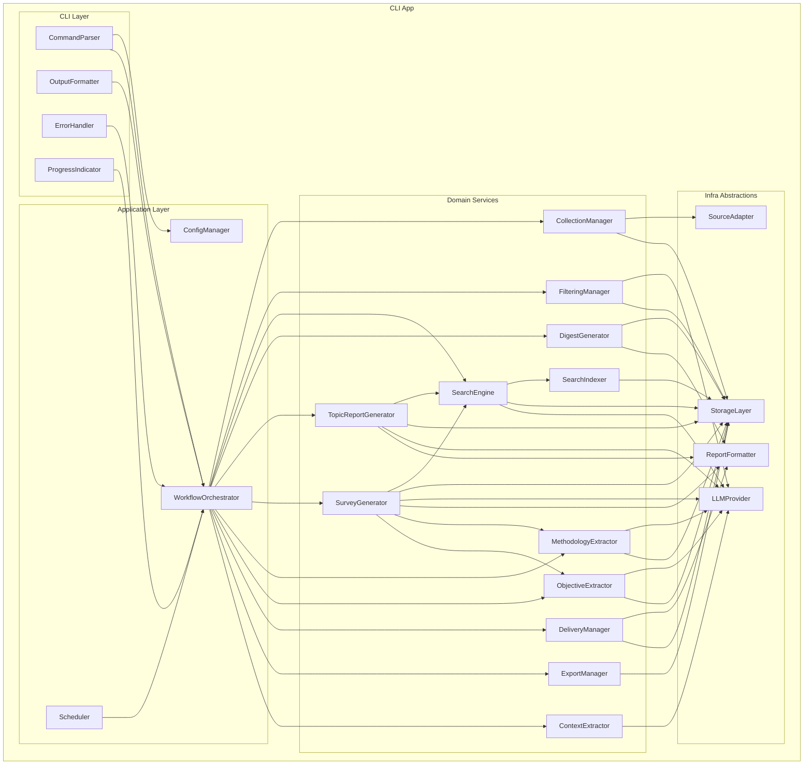

**组件分层摘要**
- **CLI Layer**：只处理命令、输入/输出、可见错误与进度，不直接依赖具体 provider 实现。
- **Application Layer**：聚焦配置装配、工作流编排、调度入口。
- **Domain Services**：承载 collection、filtering、search、digest、topic report 等业务能力。
- **Infra Abstractions**：通过端口/适配器隔离 source、LLM、storage、formatting 的具体实现。

## 3. 【逻辑视图】ER 图 + Schema

### 3.1 Mermaid ER 图

下图描述 v01 最小逻辑对象，而不是最终物理表的完全展开版本。对象之间的 `paper_ids` / 引用列表是否采用 JSON 数组还是关联表，仍有部分为 `[待决策]`。

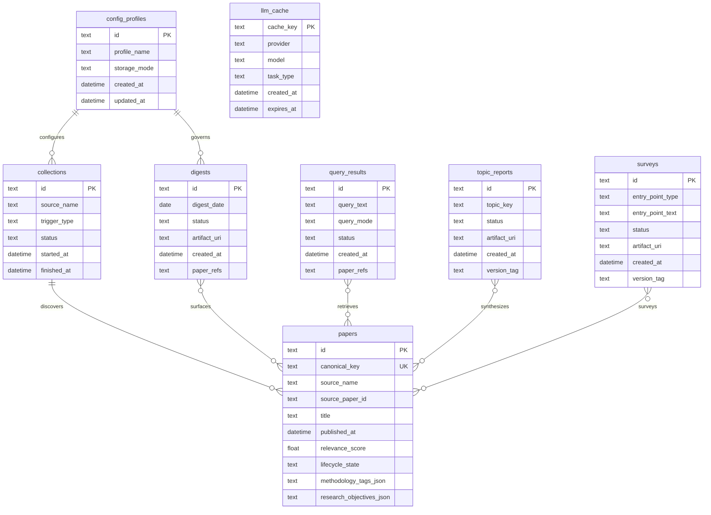

### 3.2 Schema 设计说明

#### `papers`
- **角色**：本地 library 的核心复用对象；所有 digest、query result、paper detail、topic report 最终都回到 `papers`。
- **主键**：`id`
- **关键字段**：
  - `canonical_key`：跨来源去重键，优先由 `arxiv_id / doi / normalized_title_hash` 组成
  - `source_name` / `source_paper_id`：来源与来源内标识
  - `title` / `abstract` / `authors_json` / `published_at`
  - `topics_json`：topic/tag 列表
  - `methodology_tags_json`：方法/技术手段标签列表（如 MCTS、contrastive learning、attention mechanism 等）
  - `research_objectives_json`：研究目标/待解决问题标签列表（如 reduce hallucination、improve retrieval accuracy 等）
  - `relevance_score` / `relevance_band`
  - `metadata_json`：来源特有扩展字段
  - `lifecycle_state`：见过程视图中的 paper lifecycle
- **重要索引**：
  - `UNIQUE(canonical_key)`
  - `INDEX(source_name, published_at)`
  - `INDEX(relevance_score)`
  - `INDEX(lifecycle_state)`
  - `FTS5(title, abstract, topics_json, methodology_tags_json, research_objectives_json)`
- **约束说明**：
  - v01 以 metadata-first 为主，不要求 PDF 正文进入主 schema
  - `paper detail` 必须能从 `papers` 单体对象稳定恢复，不依赖临时 query 上下文

#### `collections`
- **角色**：记录一次 collection workflow 的输入边界、来源、结果统计与失败摘要。
- **主键**：`id`
- **关键字段**：
  - `source_name`
  - `trigger_type`：manual / scheduled / initialization
  - `config_profile_id`：`[待确认]`，取决于是否引入 DB profile object
  - `started_at` / `finished_at`
  - `status`
  - `collected_count` / `new_count` / `duplicate_count`
  - `error_summary_json`
- **重要索引**：
  - `INDEX(source_name, started_at)`
  - `INDEX(status, started_at)`
- **备注**：collection 是操作日志对象，不是长期知识对象。

#### `digests`
- **角色**：默认 daily intake artifact；稳定对象之一。
- **主键**：`id`
- **关键字段**：
  - `digest_date`
  - `config_profile_id`：`[待确认]`
  - `summary_json`
  - `high_confidence_refs`
  - `supplemental_refs`
  - `artifact_uri`
  - `status`
- **重要索引**：
  - `UNIQUE(digest_date, config_profile_id)` 或 `UNIQUE(digest_date)`：取决于 profile 模型 `[待确认]`
  - `INDEX(created_at)`
- **存储形态**：
  - `paper_refs` 可为 JSON 数组，也可拆为 `digest_items` 关联表 `[待决策]`
  - Markdown/JSON artifact 是否双写由 delivery/export 策略决定 `[待决策]`

#### `query_results`
- **角色**：`search` 之上的稳定输出对象；可以承载 retrieval、structured QA、topic clustering 三类结果。
- **主键**：`id`
- **关键字段**：
  - `query_text`
  - `query_mode`：retrieval / qa / clustering / context-aware
  - `filters_json`
  - `answer_json`
  - `paper_refs`
  - `status`
  - `created_at`
- **重要索引**：
  - 若持久化：`INDEX(created_at)`、`INDEX(query_mode, created_at)`
- **存储形态**：
  - 是否默认持久化到 DB：`[待确认]`
  - 若持久化，使用 JSON blob 还是 normalized item rows：`[待确认]`
  - 若不持久化，则仍作为稳定 CLI/JSON object 存在
- **特别说明**：Query mode 默认优先返回哪种上层结果仍为 `[待确认]`。

#### `topic_reports`
- **角色**：独立 artifact，对同一 topic 的阶段性综合结果进行保存与复用。
- **主键**：`id`
- **关键字段**：
  - `topic_key`
  - `date_range_json`
  - `report_body`
  - `subtopic_outline_json`
  - `paper_refs`
  - `artifact_uri`
  - `model_info_json`
  - `status`
  - `version_tag`：是否需要多版本 lifecycle 为 `[待确认]`
- **重要索引**：
  - `INDEX(topic_key, created_at)`
  - 若支持多版本：`INDEX(topic_key, version_tag)` `[待确认]`
- **存储形态**：
  - `paper_refs` 使用 JSON 还是关联表 `[待决策]`
  - 轻量 fallback report 是否允许落库 `[待确认]`

#### `surveys`
- **角色**：文献综述 artifact；深度高于 topic report，涵盖问题定义、方法分类学、对比分析、研究空白与未来方向。
- **主键**：`id`
- **关键字段**：
  - `entry_point_type`：综述切入方式，如 topic / method / objective / combined
  - `entry_point_text`：切入描述文本
  - `date_range_json`
  - `survey_body`：综述正文
  - `problem_definition`：问题定义段
  - `method_taxonomy_json`：方法分类学结构
  - `comparative_analysis_json`：对比分析
  - `research_gaps_json`：研究空白识别
  - `future_directions_json`：未来方向建议
  - `paper_refs`
  - `artifact_uri`
  - `model_info_json`
  - `status`
  - `version_tag`：是否支持多版本为 `[待确认]`
- **重要索引**：
  - `INDEX(entry_point_type, created_at)`
  - `INDEX(created_at)`
- **存储形态**：
  - `paper_refs` 使用 JSON 还是关联表 `[待决策]`

#### `llm_cache`
- **角色**：降低相同 prompt / task / provider 组合的重复调用成本。
- **主键**：`cache_key`
- **关键字段**：
  - `provider`
  - `model`
  - `task_type`：relevance / classification / synthesis / context-extraction
  - `input_hash`
  - `response_json`
  - `created_at`
  - `expires_at`：TTL 策略 `[待决策]`
  - `prompt_version`
- **重要索引**：
  - `INDEX(provider, model, task_type)`
  - `INDEX(created_at)`
- **约束说明**：缓存仅缓存模型输入输出，不改变上层对象定义。

#### `config_profiles`
- **角色**：逻辑上的“可复用配置画像”；物理上可能仅为 YAML，也可能被镜像进 DB。
- **主键**：`id`
- **关键字段**：
  - `profile_name`
  - `topics_json`
  - `keywords_json`
  - `sources_json`
  - `provider_settings_json`
  - `digest_settings_json`
  - `created_at` / `updated_at`
- **重要索引**：
  - `UNIQUE(profile_name)`
- **存储形态**：
  - YAML only vs YAML + DB profile object：`[待确认]`
- **约束说明**：无论物理是否落库，逻辑上都需要 `config profile` 这个概念来支持 digest、collection、report 的 traceability。

### 3.3 逻辑一致性结论
- `papers` 是唯一基础知识对象，扩展了 `methodology_tags_json` 和 `research_objectives_json` 两个结构化字段。
- `digests`、`query_results`、`topic_reports`、`surveys` 是稳定输出对象，必须引用 `papers` 而不是复制出另一套 paper schema。
- `surveys` 是 `topic_reports` 之上的更高级产物，共用 search 检索基础层但增加了方法分类与对比分析能力。
- `paper detail` 是 `papers` 的投影视图，不需要单独独立表。
- v01 优先保证对象复用与本地可查询性，而不是过早做分布式实体拆分。

## 4. 【过程视图】时序图 + 状态机

### 4.1 初始化到首份 Digest

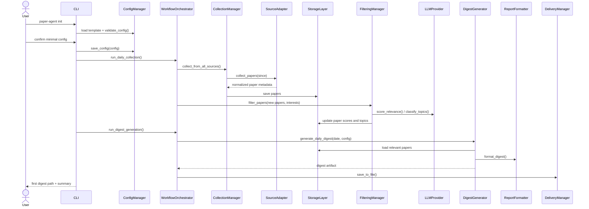

### 4.2 每日 Collection + Filtering + Digest Generation

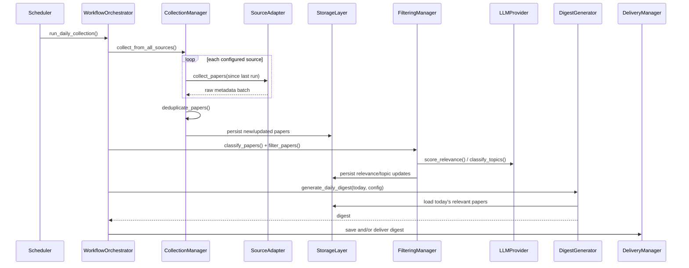

### 4.3 Query → Search → Structured QA / Clustering

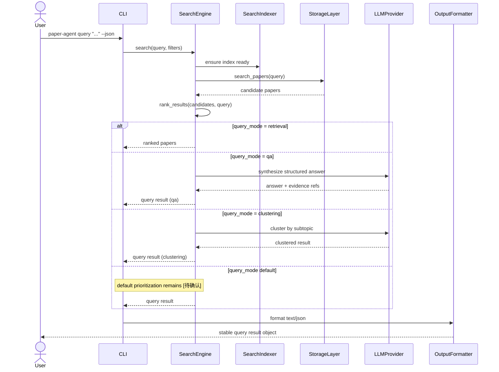

### 4.4 Topic Report Generation

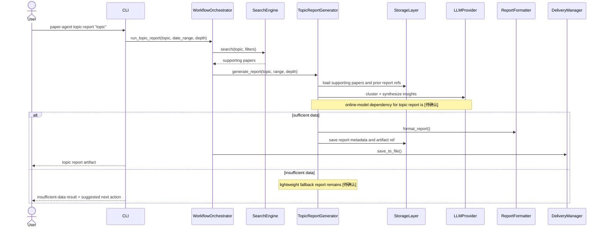

### 4.5 Method-Similarity Paper Discovery

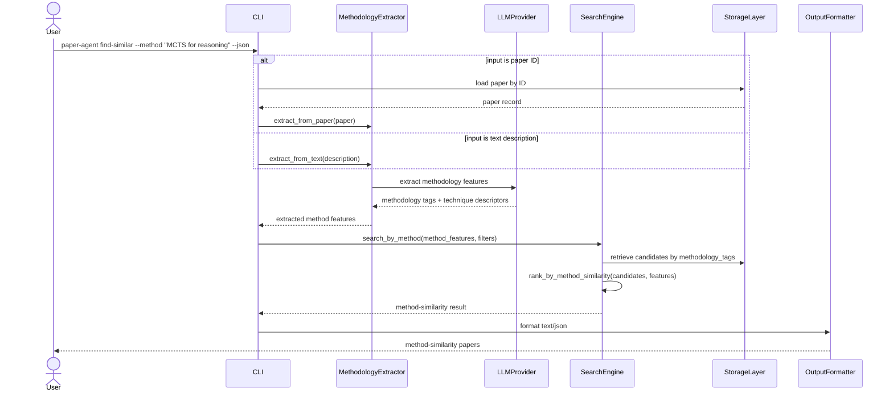

### 4.6 Objective-Based Paper Discovery

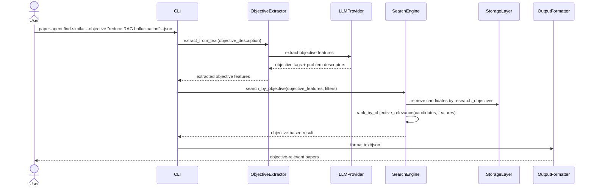

### 4.7 Survey Generation

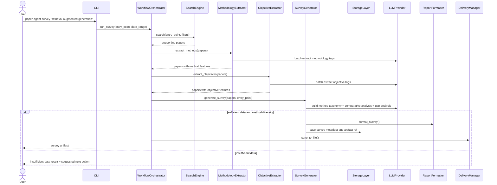

### 4.8 Agent Context-Aware Retrieval

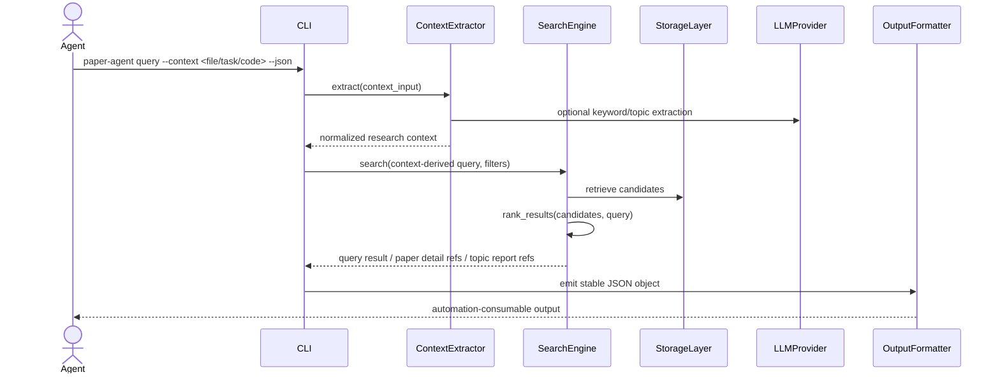

### 4.6 状态机

#### Paper Lifecycle

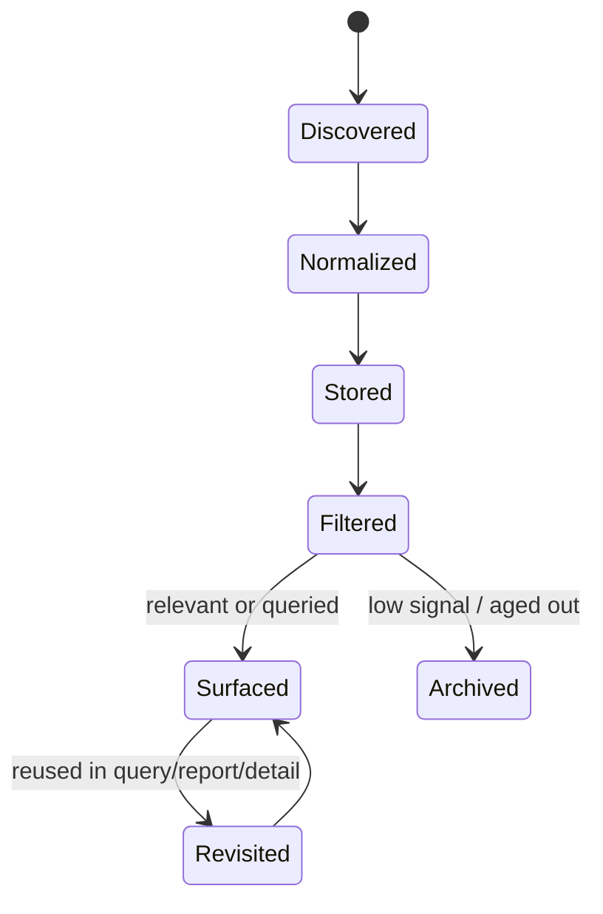

#### Digest Lifecycle

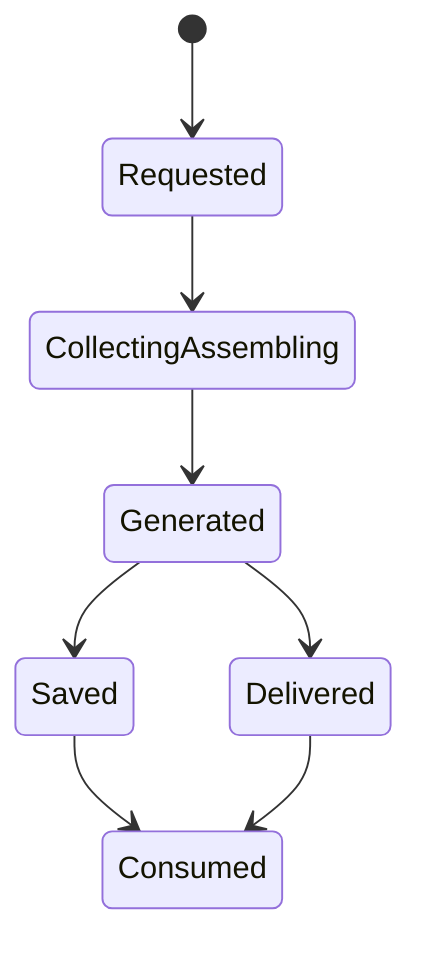

#### Topic Report Lifecycle

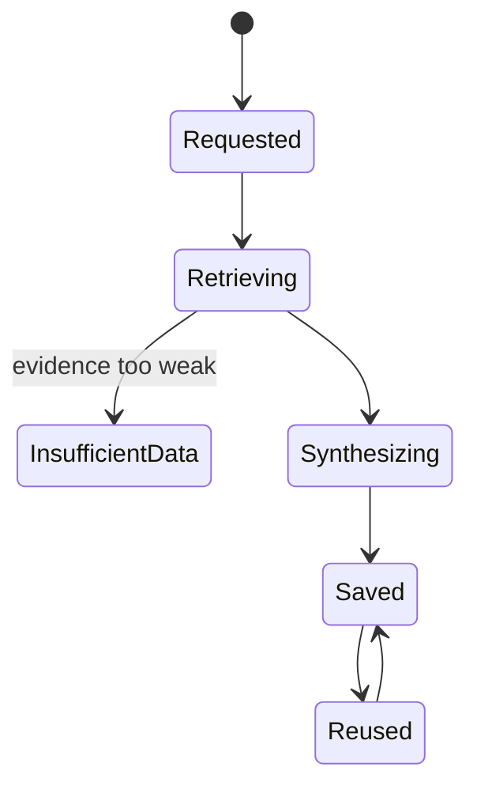

#### Survey Lifecycle

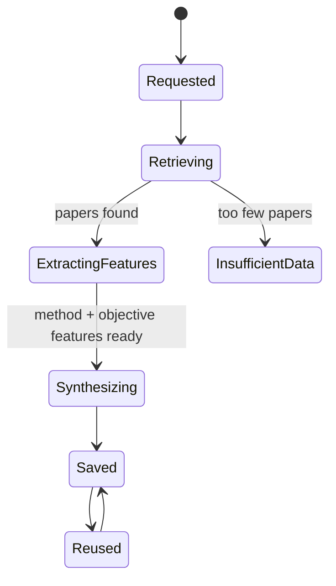

### 4.9 `+1` 场景视角（Use-Case Mapping）
- `Requirement S1 / UC-01`：对应 **4.1 初始化到首份 Digest**。
- `Requirement S2 / UC-02`：对应 **4.2 每日 Collection + Filtering + Digest Generation**。
- `Requirement S3 / UC-03`：对应 **4.3 Query → Search → Structured QA / Clustering**。
- `Requirement S4 / UC-04`：对应 **4.4 Topic Report Generation**。
- `Requirement S6 / UC-06`：对应 **4.5 Method-Similarity Paper Discovery**。
- `Requirement S7 / UC-07`：对应 **4.6 Objective-Based Paper Discovery**。
- `Requirement S8 / UC-08`：对应 **4.7 Survey Generation**。
- `Requirement S5 / UC-05`：对应 **4.8 Agent Context-Aware Retrieval**。
- Inbox / reading queue 仍被视为 digest 后续辅助路径，而非 4+1 主架构对象；其 queue granularity、是否支持多个队列仍为 `[待确认]`。

**过程视图结论**
- Search 是 retrieval base layer，QA / clustering / topic report / survey 都建立其上。
- Topic report 是 artifact lifecycle，而不是一次性终端输出。
- Survey 是 topic report 之上的更高级 artifact，额外依赖 MethodologyExtractor 和 ObjectiveExtractor。
- 方法相似性与目标相似性是 search 的两个新检索维度，与 topic/keyword 检索正交。
- Agent 场景与 human CLI 场景共用同一条领域服务链，只在输入来源与输出格式上不同。

## 5. 【开发视图】目录结构 + 模块依赖 + 分层依赖规则

### 5.1 建议目录结构

```text
paper_agent/
  cli/
    command_parser.py
    output_formatter.py
    error_handler.py
    progress_indicator.py
    commands/
  app/
    config_manager.py
    workflow_orchestrator.py
    scheduler.py
  domain/
    models/
    value_objects/
    policies/
    exceptions.py
  services/
    collection_manager.py
    filtering_manager.py
    search_engine.py
    search_indexer.py
    digest_generator.py
    topic_report_generator.py
    survey_generator.py
    methodology_extractor.py
    objective_extractor.py
    delivery_manager.py
    export_manager.py
    context_extractor.py
  contracts/
    dto.py
    json_schema/
    automation_api.yaml
    protobuf/
  infra/
    storage/
      storage_layer.py
      sqlite_storage.py
      migrations/
    sources/
      source_adapter.py
      arxiv_adapter.py
      conference_adapter.py
    llm/
      llm_provider.py
      anthropic_provider.py
      openai_provider.py
      local_provider.py
      cache.py
    reports/
      report_formatter.py
  export/
    markdown_export.py
    json_export.py
    html_export.py
tests/
  unit/
  integration/
  contract/
```

### 5.2 模块依赖图

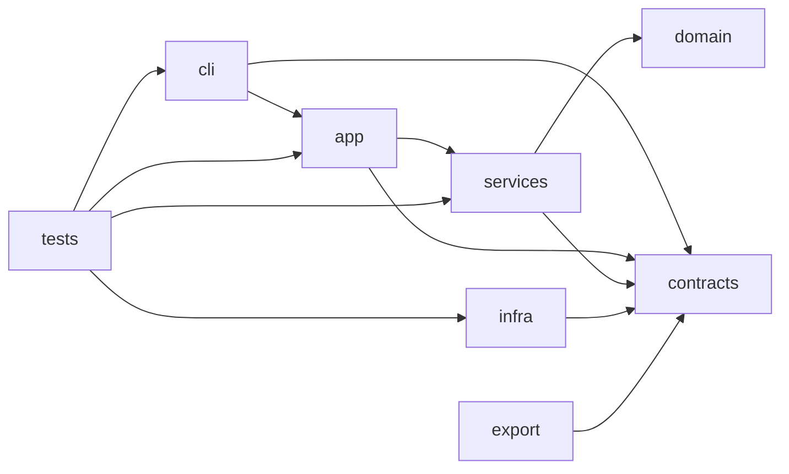

### 5.3 分层依赖规则
- **CLI depends inward only**：`cli/` 只能依赖 `app/`、`contracts/`，不能直接依赖具体 `infra` provider。
- **Application orchestrates services**：`app/` 负责装配与编排，不承载 provider-specific 逻辑。
- **Service/domain depends on abstractions**：`services/` 和 `domain/` 依赖 `contracts/` 中定义的接口与 DTO，不反向 import `infra` 实现。
- **Infra implements ports/adapters**：`infra/` 只实现 `SourceAdapter`、`LLMProvider`、`StorageLayer`、`ReportFormatter` 等抽象。
- **No reverse imports**：禁止 `infra -> services/domain` 的反向业务调用；装配应由 `app/` 完成。
- **Contracts are stable boundary**：automation-facing JSON schema、内部 DTO、错误对象应集中在 `contracts/`。
- **Tests follow boundary type**：
  - `unit/` 测单个 manager/provider
  - `integration/` 测 workflow
  - `contract/` 测 `digest/query result/paper detail/topic report` 的结构稳定性

### 5.4 开发视图结论
- 该结构支持“接口先行、实现后置”的 v01 开发方式。
- 目录结构刻意突出 `contracts/`，因为 automation compatibility 是核心质量约束。
- 不引入 web server、message bus、distributed worker 等额外目录，保持 CLI-first 边界。

## 6. 【物理视图】部署拓扑

v01 推荐部署形态是本地 CLI 部署；没有必须常驻的远端 control plane。

```mermaid
flowchart LR
    subgraph machine[User Machine]
        user[User / Automation Agent]
        scheduler[Optional Scheduler\ncron / launchd / task scheduler [待决策]]
        cli[Paper Agent CLI]
        config[Local Config Files\nYAML / .env / secret store]
        sqlite[(Local SQLite DB)]
        artifacts[(Generated Artifacts\ndigest / topic report / json outputs)]
    end

    arxiv[arXiv Metadata Source]
    conf[Conference Sources\nextensible]
    llm[LLM APIs / local model bridge]

    user --> cli
    scheduler --> cli
    cli <--> config
    cli <--> sqlite
    cli --> artifacts
    cli --> arxiv
    cli -. extensible .-> conf
    cli --> llm
```

**部署说明**
- **默认部署**：单机、单用户、本地文件系统、本地 SQLite。
- **网络边界**：仅对论文元数据源与 LLM provider 发起出站请求。
- **调度方式**：内建 scheduler、系统 cron、launchd、Task Scheduler 等实现路径均可，但具体选择为 `[待决策]`。
- **未来替代形态**：Docker、service mode、本地 HTTP wrapper、API server 均属于后续演化方向，当前统一标记为 `[待决策]`。

## 7. 【API 契约】OpenAPI/Protobuf

### 7.1 契约定位
- Requirement 明确 v01 不以 public API design 为中心；因此这里定义的是 **automation-facing contract**，用于约束 CLI JSON 输出与未来 wrapper/service 的统一对象结构。
- v01 当前承诺的是 **CLI + stable JSON object**，不是公开网络 API。
- 为了表达资源与对象边界，本文采用 **REST-like OpenAPI draft** 作为说明载体；最终 transport 是 local HTTP、CLI wrapper 还是 Protobuf/gRPC 仍为 `[待决策]`。

### 7.2 稳定对象与 CLI 映射

| 稳定对象 | 当前首要入口 | 未来资源路径草案 | 说明 |
|---|---|---|---|
| `digest` | `paper-agent digest --json` | `POST /digest` / `GET /digest/{id}` `[待决策]` | daily intake artifact |
| `query result` | `paper-agent query "..." --json` | `POST /query` | search 上层对象 |
| `paper detail` | `paper-agent show <id> --json` | `GET /papers/{id}` | `papers` 的稳定投影 |
| `topic report` | `paper-agent topic-report "..." --json` | `POST /topic-reports` / `GET /topic-reports/{id}` `[待决策]` | 独立 artifact |
| `survey` | `paper-agent survey "..." --json` | `POST /surveys` / `GET /surveys/{id}` `[待决策]` | 高级综述 artifact |

### 7.3 OpenAPI Draft

```yaml
openapi: 3.1.0
info:
  title: Paper Agent Automation Contract
  version: v01-draft
  description: >
    Internal/service-facing contract draft for automation consumers.
    This is not a committed public network API for v01.
servers:
  - url: http://localhost/[待决策]
paths:
  /digest:
    post:
      summary: Generate or fetch a digest artifact
      requestBody:
        required: true
        content:
          application/json:
            schema:
              type: object
              properties:
                date:
                  type: string
                  format: date
                profile:
                  type: string
                  nullable: true
                top_n:
                  type: integer
                include_supplemental:
                  type: boolean
      responses:
        '200':
          description: Digest object
          content:
            application/json:
              schema:
                $ref: '#/components/schemas/Digest'
  /query:
    post:
      summary: Run retrieval / QA / clustering over local paper library
      requestBody:
        required: true
        content:
          application/json:
            schema:
              $ref: '#/components/schemas/QueryRequest'
      responses:
        '200':
          description: Query result object
          content:
            application/json:
              schema:
                $ref: '#/components/schemas/QueryResult'
  /papers/{id}:
    get:
      summary: Fetch paper detail by stable paper id
      parameters:
        - name: id
          in: path
          required: true
          schema:
            type: string
      responses:
        '200':
          description: Paper detail object
          content:
            application/json:
              schema:
                $ref: '#/components/schemas/PaperDetail'
        '404':
          description: Paper not found
  /find-similar:
    post:
      summary: Find papers by method similarity or objective similarity
      requestBody:
        required: true
        content:
          application/json:
            schema:
              type: object
              properties:
                paper_id:
                  type: string
                  nullable: true
                method_description:
                  type: string
                  nullable: true
                objective_description:
                  type: string
                  nullable: true
                mode:
                  type: string
                  enum: [method, objective, combined]
                filters:
                  type: object
      responses:
        '200':
          description: Similarity result object
          content:
            application/json:
              schema:
                $ref: '#/components/schemas/SimilarityResult'
        '422':
          description: Cannot extract valid features from input
  /surveys:
    post:
      summary: Generate a structured literature survey artifact
      requestBody:
        required: true
        content:
          application/json:
            schema:
              type: object
              required: [entry_point]
              properties:
                entry_point:
                  type: string
                entry_point_type:
                  type: string
                  enum: [topic, method, objective, combined]
                date_range:
                  type: object
                  properties:
                    start:
                      type: string
                      format: date
                    end:
                      type: string
                      format: date
      responses:
        '200':
          description: Survey object
          content:
            application/json:
              schema:
                $ref: '#/components/schemas/Survey'
        '422':
          description: Insufficient data or invalid request
  /topic-reports:
    post:
      summary: Generate a reusable topic report artifact
      requestBody:
        required: true
        content:
          application/json:
            schema:
              type: object
              required: [topic]
              properties:
                topic:
                  type: string
                date_range:
                  type: object
                  properties:
                    start:
                      type: string
                      format: date
                    end:
                      type: string
                      format: date
                depth:
                  type: string
                  enum: [light, medium, deep]
                reuse_existing:
                  type: boolean
      responses:
        '200':
          description: Topic report object
          content:
            application/json:
              schema:
                $ref: '#/components/schemas/TopicReport'
        '422':
          description: Insufficient data or invalid request
components:
  schemas:
    PaperSummary:
      type: object
      required: [id, title, source, published_at]
      properties:
        id:
          type: string
        title:
          type: string
        source:
          type: string
        published_at:
          type: string
          format: date-time
        relevance_score:
          type: number
        topics:
          type: array
          items:
            type: string
    Digest:
      type: object
      required: [object_type, id, date, summary, high_confidence_papers]
      properties:
        object_type:
          type: string
          const: digest
        id:
          type: string
        date:
          type: string
          format: date
        summary:
          type: object
        high_confidence_papers:
          type: array
          items:
            $ref: '#/components/schemas/PaperSummary'
        supplemental_papers:
          type: array
          items:
            $ref: '#/components/schemas/PaperSummary'
        artifact_uri:
          type: string
          nullable: true
    QueryRequest:
      type: object
      required: [query]
      properties:
        query:
          type: string
        mode:
          type: string
          enum: [retrieval, qa, clustering, context-aware]
        filters:
          type: object
        context:
          type: object
          nullable: true
    QueryResult:
      type: object
      required: [object_type, id, query, mode, papers]
      properties:
        object_type:
          type: string
          const: query_result
        id:
          type: string
        query:
          type: string
        mode:
          type: string
        answer:
          type: object
          nullable: true
        clusters:
          type: array
          items:
            type: object
          nullable: true
        papers:
          type: array
          items:
            $ref: '#/components/schemas/PaperSummary'
    PaperDetail:
      type: object
      required: [object_type, id, title, abstract, source]
      properties:
        object_type:
          type: string
          const: paper_detail
        id:
          type: string
        title:
          type: string
        authors:
          type: array
          items:
            type: string
        abstract:
          type: string
        source:
          type: string
        published_at:
          type: string
          format: date-time
        topics:
          type: array
          items:
            type: string
        relevance:
          type: object
        recommendation_reason:
          type: string
        related_context:
          type: object
          nullable: true
    TopicReport:
      type: object
      required: [object_type, id, topic, sections, papers]
      properties:
        object_type:
          type: string
          const: topic_report
        id:
          type: string
        topic:
          type: string
        date_range:
          type: object
          nullable: true
        sections:
          type: array
          items:
            type: object
        papers:
          type: array
          items:
            $ref: '#/components/schemas/PaperSummary'
        artifact_uri:
          type: string
          nullable: true
        report_version:
          type: string
          nullable: true
    SimilarityResult:
      type: object
      required: [object_type, id, mode, papers]
      properties:
        object_type:
          type: string
          const: similarity_result
        id:
          type: string
        mode:
          type: string
          enum: [method, objective, combined]
        input_features:
          type: object
          description: Extracted method or objective features used for matching
        papers:
          type: array
          items:
            allOf:
              - $ref: '#/components/schemas/PaperSummary'
              - type: object
                properties:
                  similarity_score:
                    type: number
                  matched_features:
                    type: array
                    items:
                      type: string
    Survey:
      type: object
      required: [object_type, id, entry_point, sections, papers]
      properties:
        object_type:
          type: string
          const: survey
        id:
          type: string
        entry_point:
          type: string
        entry_point_type:
          type: string
          enum: [topic, method, objective, combined]
        date_range:
          type: object
          nullable: true
        problem_definition:
          type: string
        method_taxonomy:
          type: array
          items:
            type: object
            properties:
              category:
                type: string
              methods:
                type: array
                items:
                  type: string
              papers:
                type: array
                items:
                  $ref: '#/components/schemas/PaperSummary'
        comparative_analysis:
          type: object
          nullable: true
        research_gaps:
          type: array
          items:
            type: string
        future_directions:
          type: array
          items:
            type: string
        sections:
          type: array
          items:
            type: object
        papers:
          type: array
          items:
            $ref: '#/components/schemas/PaperSummary'
        artifact_uri:
          type: string
          nullable: true
        survey_version:
          type: string
          nullable: true
    ErrorResult:
      type: object
      required: [object_type, error_code, message]
      properties:
        object_type:
          type: string
          const: error
        error_code:
          type: string
        message:
          type: string
        suggested_action:
          type: string
          nullable: true
```

### 7.4 Protobuf / gRPC 说明
- 若未来选择 Protobuf/gRPC，则消息对象应与上表一一对应：`Digest`、`QueryResult`、`PaperDetail`、`TopicReport`、`ErrorResult`。
- **最终 transport 选择**：`REST-like JSON` vs `Protobuf/gRPC` 仍为 `[待决策]`。
- **当前设计立场**：先稳定对象语义与 JSON shape，再决定 wire protocol；避免在 v01 阶段把 transport 选择误当成产品能力承诺。

### 7.5 契约约束结论
- v01 先承诺对象层兼容，不先承诺网络层部署方式。
- `digest/query result/paper detail/topic report/survey` 五类对象是自动化契约的一等公民。
- 即使将来新增 service wrapper，也不得改变五类对象的基本语义。

## 8. 【函数契约】

以下函数契约面向设计层接口，不绑定具体实现类名后缀。签名以 Python 风格表示，异常名为设计级概念异常。

### 8.1 `ConfigManager`

```python
load_config(profile: str | None = None) -> ConfigProfile
save_config(config: ConfigProfile) -> None
validate_config(config: ConfigProfile) -> ValidationResult
```

- **Preconditions**
  - `load_config`：若指定 `profile`，该 profile 必须可在 YAML/DB 配置源中解析；配置存储 split 为 `[待确认]`
  - `save_config`：输入对象必须包含 v01 最小必要字段：`topics`、`keywords`、`sources`、`llm_provider`
  - `validate_config`：配置对象已完成基本语法解析
- **Postconditions**
  - `load_config`：返回可供 collection / filtering / digest 直接使用的有效配置对象
  - `save_config`：持久化配置被写入主配置存储，且不会泄露 secret 到 artifact 输出
  - `validate_config`：返回完整校验结果，明确缺失项与冲突项
- **Invariants**
  - 有效配置必须保持 `digest-first` 默认策略
  - API key / secret 不进入 digest、query result、topic report 等稳定对象
- **Exceptions**
  - `ConfigurationNotFoundError`
  - `ConfigurationValidationError`
  - `ConfigurationPersistenceError`
- **Design Pattern**
  - `Facade`；对 YAML/env/secret store/DB profile 的聚合访问是否包含 `Repository/Gateway` 仍为 `[待确认]`

### 8.2 `WorkflowOrchestrator`

```python
run_daily_collection() -> CollectionResult
run_digest_generation(date: date | None = None) -> DigestResult
run_topic_report(topic: str, date_range: DateRange | None = None, depth: str = "medium") -> ReportResult
run_survey(entry_point: str, entry_point_type: str = "topic", date_range: DateRange | None = None) -> SurveyResult
run_method_similarity(input: str, input_type: str = "text") -> SimilarityResult
run_objective_similarity(objective: str) -> SimilarityResult
```

- **Preconditions**
  - 配置已通过 `ConfigManager.validate_config`
  - 运行期依赖 `CollectionManager`、`FilteringManager`、`DigestGenerator`、`TopicReportGenerator` 已装配完成
- **Postconditions**
  - `run_daily_collection`：完成采集、去重、分类与必要状态更新
  - `run_digest_generation`：返回或保存一个稳定 `digest` 对象
  - `run_topic_report`：返回稳定 `topic report` 或数据不足结果
  - `run_survey`：返回稳定 `survey` 或数据不足结果
  - `run_method_similarity`：返回方法相似性检索结果
  - `run_objective_similarity`：返回目标相似性检索结果
- **Invariants**
  - 编排顺序必须保持 `collection -> filter -> output object`
  - Search 仍是 topic synthesis 与 survey 的基础检索层
  - Survey 额外依赖 MethodologyExtractor 和 ObjectiveExtractor
- **Exceptions**
  - `WorkflowConfigurationError`
  - `DependencyUnavailableError`
  - `WorkflowExecutionError`
- **Design Pattern**
  - `Facade / Orchestrator`

### 8.3 `SourceAdapter`

```python
collect_papers(since: datetime, until: datetime | None = None) -> list[Paper]
get_paper_metadata(identifier: str) -> Paper
normalize_metadata(raw_data: dict) -> Paper
```

- **Preconditions**
  - 外部来源凭证、速率限制与来源配置有效
  - `identifier` 对应来源可识别的原始标识
- **Postconditions**
  - `collect_papers`：返回来源原始数据经归一化后的 paper 列表
  - `get_paper_metadata`：返回单篇 paper 的最小完整 metadata
  - `normalize_metadata`：输出满足统一 `Paper` 逻辑对象约束
- **Invariants**
  - adapter 只处理来源差异，不应引入上层 relevance 或 digest 逻辑
  - metadata-first，不能要求 PDF 正文作为必须输入
- **Exceptions**
  - `SourceRateLimitError`
  - `SourceAuthenticationError`
  - `SourceNormalizationError`
- **Design Pattern**
  - `Adapter`

### 8.4 `CollectionManager`

```python
collect_from_all_sources() -> CollectionResult
collect_from_source(source: str) -> CollectionResult
add_paper_manually(identifier: str) -> Paper
deduplicate_papers(papers: list[Paper]) -> list[Paper]
```

- **Preconditions**
  - 至少存在一个启用的 `SourceAdapter`
  - `StorageLayer` 可写
- **Postconditions**
  - `collect_from_all_sources`：完成多来源收集与结果汇总
  - `deduplicate_papers`：基于 `canonical_key` 或等效规则去重后返回稳定列表
- **Invariants**
  - 去重规则在单次 workflow 内必须确定且幂等
  - 不得因 conference 扩展而破坏 arXiv primary path
- **Exceptions**
  - `CollectionSourceUnavailableError`
  - `PaperDeduplicationError`
  - `CollectionPersistenceError`
- **Design Pattern**
  - `Facade` over multiple `Adapter` instances

### 8.5 `LLMProvider`

```python
score_relevance(paper: Paper, interests: Interests) -> RelevanceScore
classify_topics(paper: Paper) -> list[str]
extract_keywords(text: str) -> list[str]
extract_methodology(text: str) -> list[str]
extract_objectives(text: str) -> list[str]
synthesize_survey_section(papers: list[Paper], section_type: str) -> str
```

- **Preconditions**
  - provider 配置有效
  - 输入文本长度与模型能力边界可接受
- **Postconditions**
  - `score_relevance`：返回可比较、可持久化的 relevance 结果
  - `classify_topics`：返回可进入 `topics_json` 的 topic/tag 集合
  - `extract_keywords`：返回用于 query/context-aware retrieval 的关键词集合
  - `extract_methodology`：返回论文使用的方法/技术标签
  - `extract_objectives`：返回论文的研究目标/待解决问题标签
  - `synthesize_survey_section`：生成综述的指定段落（问题定义/方法分类/对比分析/空白/方向）
- **Invariants**
  - provider 差异不应改变上层对象语义
  - 输出应可缓存、可重试、可被上层验证
- **Exceptions**
  - `LLMProviderUnavailableError`
  - `LLMRateLimitError`
  - `LLMStructuredOutputError`
- **Design Pattern**
  - `Strategy / Provider`

### 8.6 `FilteringManager`

```python
filter_papers(papers: list[Paper], interests: Interests) -> list[Paper]
classify_papers(papers: list[Paper]) -> list[Paper]
batch_process(papers: list[Paper], interests: Interests) -> list[Paper]
```

- **Preconditions**
  - 输入 `papers` 已完成 metadata normalization
  - `LLMProvider` 或 fallback policy 已装配
- **Postconditions**
  - `filter_papers`：返回被打分并完成 relevance 标识的 papers
  - `classify_papers`：每篇 paper 拥有可复用的 topic/tag 信息
  - `batch_process`：在一次批处理中完成过滤与分类的必要步骤
- **Invariants**
  - filtering 结果必须可回写到 `papers`，不得只存在于临时内存
  - relevance 与 topic classification 必须能被 digest、search、topic report 复用
- **Exceptions**
  - `FilteringInputError`
  - `FilteringExecutionError`
  - `LLMCacheCorruptionError`
- **Design Pattern**
  - `Facade` + delegated `Strategy/Provider`

### 8.7 `MethodologyExtractor`

```python
extract_from_paper(paper: Paper) -> MethodologyFeatures
extract_from_text(description: str) -> MethodologyFeatures
batch_extract(papers: list[Paper]) -> list[Paper]
```

- **Preconditions**
  - 输入 paper 至少包含 title 和 abstract
  - 文本描述非空且表达了可识别的方法/技术
- **Postconditions**
  - `extract_from_paper`：返回结构化方法特征，包含 technique tags、algorithm names、framework descriptors
  - `extract_from_text`：从自由文本中提取标准化方法特征
  - `batch_extract`：批量完成方法提取并回写到 paper 的 `methodology_tags_json`
- **Invariants**
  - 方法提取基于 title + abstract，不依赖 PDF 正文
  - 提取结果必须可持久化到 `papers` 表并可被 search 复用
- **Exceptions**
  - `MethodExtractionFailedError`：输入过于模糊无法提取有效方法特征
  - `LLMProviderUnavailableError`
- **Design Pattern**
  - `Facade` + delegated `Strategy/Provider`

### 8.8 `ObjectiveExtractor`

```python
extract_from_paper(paper: Paper) -> ObjectiveFeatures
extract_from_text(description: str) -> ObjectiveFeatures
batch_extract(papers: list[Paper]) -> list[Paper]
```

- **Preconditions**
  - 输入 paper 至少包含 title 和 abstract
  - 文本描述非空且表达了可识别的研究目标或问题
- **Postconditions**
  - `extract_from_paper`：返回结构化目标特征，包含 problem tags、objective descriptors
  - `extract_from_text`：从自由文本中提取标准化目标特征
  - `batch_extract`：批量完成目标提取并回写到 paper 的 `research_objectives_json`
- **Invariants**
  - 目标提取基于 title + abstract，不依赖 PDF 正文
  - 目标维度与方法维度正交，extractor 不处理方法信息
- **Exceptions**
  - `ObjectiveExtractionFailedError`
  - `LLMProviderUnavailableError`
- **Design Pattern**
  - `Facade` + delegated `Strategy/Provider`

### 8.9 `SearchEngine`

```python
search(query: str, filters: SearchFilters | None = None, mode: str = "retrieval") -> QueryResult
search_by_method(method_features: MethodologyFeatures, filters: SearchFilters | None = None) -> SimilarityResult
search_by_objective(objective_features: ObjectiveFeatures, filters: SearchFilters | None = None) -> SimilarityResult
rank_results(papers: list[Paper], query: str) -> list[Paper]
rank_by_method_similarity(papers: list[Paper], features: MethodologyFeatures) -> list[Paper]
rank_by_objective_relevance(papers: list[Paper], features: ObjectiveFeatures) -> list[Paper]
```

- **Preconditions**
  - 本地 library 已建立并可检索
  - `query` 非空；context-aware 模式下应先完成 context extraction
- **Postconditions**
  - `search`：返回稳定 `query result` 对象，而不仅是内部候选集合
  - `search_by_method`：返回按方法相似度排序的 `similarity result` 对象
  - `search_by_objective`：返回按目标相关度排序的 `similarity result` 对象
  - `rank_results`：返回与查询目标一致的有序 paper 列表
  - `rank_by_method_similarity`：返回按方法特征匹配度排序的 paper 列表
  - `rank_by_objective_relevance`：返回按目标特征匹配度排序的 paper 列表
- **Invariants**
  - Search 始终是 retrieval base layer
  - `query result`、`similarity result` 必须可被 paper detail、topic report、survey、agent follow-up 复用
  - 方法维度与目标维度是正交的检索维度
- **Exceptions**
  - `SearchIndexUnavailableError`
  - `SearchInputError`
  - `SearchExecutionError`
- **Design Pattern**
  - `Facade` over index + storage + optional provider-assisted synthesis

### 8.8 `DigestGenerator`

```python
generate_daily_digest(date: date, config: DigestConfig) -> Digest
select_top_papers(papers: list[Paper], count: int) -> list[Paper]
compute_statistics(papers: list[Paper]) -> DigestStats
```

- **Preconditions**
  - 已存在可用于 digest 的 filtered papers
  - `DigestConfig` 已明确 `top_n`、高低分区与输出偏好
- **Postconditions**
  - 返回一个稳定 `digest` 对象，至少包含统计摘要、推荐论文、推荐理由/信号来源
  - artifact 引用可被 `DeliveryManager` 使用
- **Invariants**
  - digest 作为默认主入口，必须优先输出高置信内容
  - 不得为凑数量破坏高低分区原则
- **Exceptions**
  - `DigestInsufficientDataError`
  - `DigestFormattingError`
  - `DigestPersistenceError`
- **Design Pattern**
  - `Builder` 用于 digest section assembly 为 `[待决策]`；当前至少采用 `Facade` 协调统计、选取与格式化

### 8.9 `TopicReportGenerator`

```python
generate_report(topic: str, date_range: DateRange | None = None, depth: str = "medium") -> TopicReport
cluster_papers(papers: list[Paper]) -> dict[str, list[Paper]]
extract_insights(papers: list[Paper]) -> list[Insight]
identify_trends(papers: list[Paper]) -> list[Trend]
```

- **Preconditions**
  - 已能通过 Search 取回与 topic 相关的 supporting papers
  - synthesis 依赖的 provider 或 fallback policy 可用；topic report 在线模型依赖仍为 `[待确认]`
- **Postconditions**
  - `generate_report`：返回可保存、可复用、可被 agent 消费的 `topic report`
  - 若证据不足，返回 `insufficient-data` 状态或降级结果；轻量 report 是否允许为 `[待确认]`
- **Invariants**
  - Topic report 建立在 search/retrieval 之上，不跳过 evidence retrieval
  - 报告必须显式引用 supporting papers
  - 同一 topic 的多版本 lifecycle 是否保留仍为 `[待确认]`
- **Exceptions**
  - `TopicReportInsufficientDataError`
  - `TopicReportSynthesisError`
  - `TopicReportPersistenceError`
- **Design Pattern**
  - `Builder` for report assembly `[待决策]` + delegated `Strategy/Provider`

### 8.10 `SurveyGenerator`

```python
generate_survey(entry_point: str, entry_point_type: str = "topic", date_range: DateRange | None = None) -> Survey
build_method_taxonomy(papers: list[Paper]) -> MethodTaxonomy
build_comparative_analysis(papers: list[Paper], taxonomy: MethodTaxonomy) -> ComparativeAnalysis
identify_research_gaps(papers: list[Paper], taxonomy: MethodTaxonomy) -> list[ResearchGap]
suggest_future_directions(papers: list[Paper], gaps: list[ResearchGap]) -> list[FutureDirection]
```

- **Preconditions**
  - 已能通过 Search 取回与 entry_point 相关的 supporting papers
  - papers 已完成方法提取（`methodology_tags_json`）和目标提取（`research_objectives_json`）
  - synthesis 依赖的 provider 可用
- **Postconditions**
  - `generate_survey`：返回可保存、可复用、可被 agent 消费的 `survey` artifact
  - survey 至少包含问题定义、方法分类学、对比分析、研究空白、未来方向
  - 若证据不足或方法多样性不够，返回 `insufficient-data` 状态
- **Invariants**
  - Survey 建立在 search/retrieval 之上，不跳过 evidence retrieval
  - Survey 必须显式引用 supporting papers
  - Survey 深度高于 topic report，包含方法对比与空白分析
- **Exceptions**
  - `SurveyInsufficientDataError`
  - `SurveySynthesisError`
  - `SurveyPersistenceError`
- **Design Pattern**
  - `Builder` for survey section assembly + delegated `Strategy/Provider`

### 8.11 `ContextExtractor`

```python
extract(input: ContextInput) -> ExtractedContext
extract_from_file(file_path: str) -> ExtractedContext
extract_from_code(code: str, language: str | None = None) -> ExtractedContext
extract_keywords(text: str) -> list[str]
extract_topics(text: str) -> list[str]
```

- **Preconditions**
  - 输入上下文必须属于可解析类型：file / code / task description / plain text
  - 文件路径与编码可访问且可读取
- **Postconditions**
  - `extract`：返回标准化 research context，用于后续 search
  - `extract_keywords` / `extract_topics`：输出可直接进入 query expansion 的结构化信号
- **Invariants**
  - extractor 负责上下文标准化，不直接决定最终 query mode
  - 输出必须对 agent 稳定可复现
- **Exceptions**
  - `ContextInputUnsupportedError`
  - `ContextExtractionError`
  - `ContextFileReadError`
- **Design Pattern**
  - `Facade` over multiple extraction routes；内部是否采用细分 `Strategy` 为 `[待决策]`

## 9. 【设计模式清单】

仅列出 v01 中有明确 architectural intent 的模式；不为了“模式化”而额外引入复杂性。

| 组件/模块 | 模式 | 解决的问题 | 为什么适合 Paper Agent v01 |
|---|---|---|---|
| `infra/sources/*`, `SourceAdapter` | Adapter | 不同来源的协议、字段、分页、限速差异需要被统一成同一个 paper metadata 接口 | arXiv 是 primary source，但 conference source 需要可扩展，不应污染上层 collection 逻辑 |
| `infra/llm/*`, `LLMProvider` | Strategy / Provider | 不同模型供应商在调用方式、成本、稳定性上差异很大 | relevance、classification、synthesis 都需要统一抽象，同时保留后续替换空间 |
| `app/workflow_orchestrator.py` | Facade / Orchestrator | collection、filtering、digest、topic report、survey 是多服务链路，CLI 不应知道内部细节 | 与 digest-first / search-based 的业务链路天然匹配 |
| `infra/storage/storage_layer.py` | Repository / Gateway `[待决策]` | 上层需要按对象语义访问 papers / digests / cache，而不是操作 SQLite 细节 | v01 需要 local-first 持久化，但是否强调 Repository 术语还是 Gateway 术语仍可后定 |
| `MethodologyExtractor`、`ObjectiveExtractor` | Facade + Strategy | 方法和目标提取需要统一接口，但内部可能根据 LLM provider 使用不同策略 | 与 LLMProvider 的 Strategy 模式一致，保持扩展性 |
| `SurveyGenerator` | Builder + Facade | survey 有多段组装需求（问题定义→分类学→对比→空白→方向），需逐段构建 | survey 比 topic report 更复杂，Builder 模式价值更明确 |
| `PromptBuilder`、`ReportFormatter`、`DigestGenerator`、`TopicReportGenerator` | Builder `[待决策]` | digest/report/prompt 都有“逐段组装”的需求，需要把组装步骤与最终表示解耦 | 有利于保证 artifact 输出稳定，但是否正式固化为 Builder 仍可根据实现复杂度决定 |

**模式边界说明**
- v01 不引入事件总线、CQRS、Saga、微服务编排等复杂模式。
- 所有模式都服务于“本地 CLI + stable objects + extensible providers”这个目标，而不是为了未来假想规模预设计。

## 10. 【ADR】

### ADR-01：CLI-first vs Web-first

**Background**
- Requirement 已明确 CLI-first 是主入口，Automation Agent 也是关键用户。

| Option | Pros | Cons |
|---|---|---|
| A. CLI-first | 与 shell / Cursor / Codex 最匹配；易脚本化；本地部署简单 | 对纯图形用户不够友好 |
| B. Web-first | 可提供更强交互与可视化 | 与 local-first、agent integration 和初始化目标不一致 |

**Decision**
- 选择 **CLI-first**。

**Rationale**
- 与 Requirement `CLI-first paper intelligence system` 和 `CLI + JSON` 的核心目标一致；Web 形态保留为未来可能性，但不进入 v01 主设计。

### ADR-02：SQLite local-first vs cloud database

**Background**
- 需求强调本地 library、可复用对象与低部署摩擦。

| Option | Pros | Cons |
|---|---|---|
| A. SQLite local-first | 零运维、可移植、适合单机 CLI | 多用户/云同步能力弱 |
| B. Cloud database | 便于共享与远程访问 | 增加运维、权限、网络依赖与成本 |

**Decision**
- 选择 **SQLite local-first**。

**Rationale**
- 最符合 v01 的单机 CLI 模式，也与 requirement 的 local library 目标直接对齐。

### ADR-03：metadata-first vs PDF-first

**Background**
- Requirement 已将 PDF 全文解析列为非目标。

| Option | Pros | Cons |
|---|---|---|
| A. metadata-first | 实现边界清晰、来源广、成本低、搜索快 | 深度全文分析能力有限 |
| B. PDF-first | 可做更深内容理解 | 复杂度和版权/抓取问题显著增加 |

**Decision**
- 选择 **metadata-first**。

**Rationale**
- v01 的核心价值在于发现、筛选、检索与 topic synthesis，不要求以 PDF 作为前提。

### ADR-04：search as base layer vs direct synthesis-first workflow

**Background**
- Requirement 与 Specification 都明确 Search 是 retrieval base layer。

| Option | Pros | Cons |
|---|---|---|
| A. Search 作为 base layer | QA、clustering、topic report 都可复用同一 retrieval 结果 | 初始设计需先把 search 边界做清楚 |
| B. 直接 synthesis-first | 原型看起来更快 | 证据边界模糊、结果不可复用、难以审计 |

**Decision**
- 选择 **Search 作为基础层**。

**Rationale**
- 这使 `query result`、`paper detail`、`topic report` 形成一致对象链路，并支持 agent follow-up。

### ADR-05：adapter/provider architecture for sources and LLMs

**Background**
- 来源与 LLM 都天然存在异构性。

| Option | Pros | Cons |
|---|---|---|
| A. 固定单一来源/单一 provider 实现 | 上手最简单 | 后续替换成本高、实现逻辑耦合 |
| B. Adapter + Provider 抽象 | 可替换、可扩展、职责清晰 | 需要额外接口设计 |

**Decision**
- 选择 **Adapter + Provider**。

**Rationale**
- 即便 MVP 收敛为 arXiv + 单 provider，实现层仍应保留 v01 设计边界，避免架构被 MVP 临时选择反向锁死。

### ADR-06：JSON-stable agent outputs as first-class contracts

**Background**
- Automation Agent 是明确目标用户，且四类对象都要求结构化可消费。

| Option | Pros | Cons |
|---|---|---|
| A. 将 JSON-stable outputs 视为一等契约 | 便于脚本化、测试与版本控制 | 需要更严格的对象定义 |
| B. 仅提供人类可读 CLI 文本 | 开发更快 | agent integration 不稳定，无法满足 Requirement |

**Decision**
- 选择 **JSON-stable outputs as first-class contracts**。

**Rationale**
- 这直接支撑 `digest/query result/paper detail/topic report` 四类对象的自动化消费能力。

### ADR-07：REST-like contract draft vs Protobuf-first automation contract `[待决策]`

**Background**
- 用户要求设计阶段明确 API 契约，但 Requirement 又不希望 v01 过早承诺 public API。

| Option | Pros | Cons |
|---|---|---|
| A. REST-like JSON / OpenAPI draft | 更易阅读、调试、与 CLI JSON 对齐 | 类型约束不如 Protobuf 严格 |
| B. Protobuf-first / gRPC | 强类型、适合长期服务化 | 与当前 CLI-first、本地部署、无 server 现状不完全匹配 |

**Decision**
- **当前文档采用 REST-like JSON / OpenAPI draft 作为对象契约表达方式；最终 runtime transport 仍为 `[待决策]`。**

**Rationale**
- 先稳定对象语义，再决定传输层，能避免在 v01 阶段误把 server 化当成范围承诺。

## 11. 【变更影响分析】

本次 rewrite 的目标是把旧版“组件说明型 design”重写为“面向架构视图 + 合同 + 决策 + 兼容性”的 Technical Design Doc，不改变 Requirement 的语义目标。

### 11.1 对现有文档集的影响

| 文档 | 影响 | 结论 |
|---|---|---|
| `requirement.md` | 不改变需求语义；设计到需求的 traceability 更明确 | Requirement 仍是目标与边界来源 |
| `spec.md` | function contracts、对象 contracts、状态机与异常路径可回映到现有功能行为和验收 | 需要用术语同步保证 `query result / paper detail / topic report` 一致 |
| `feature.md` | Feature 仍保持“由 Design 派生”；可能仅需术语与组件归属同步 | `design -> feature` 关系被进一步强化 |
| `mvp.md` | 设计文档保留 target architecture；MVP 作为范围收敛文档，后续需要 reconciliation | 当前 MVP 将 topic report、context-aware retrieval、provider breadth 收敛得更保守 |

### 11.2 回归评审点
- **术语一致性**：
  - `digest`
  - `query result`
  - `paper detail`
  - `topic report`
  - `search as base layer`
- **对象定义一致性**：四类稳定对象在 Requirement / Spec / Design 中必须语义一致。
- **Must/Should 范围一致性**：不能因为设计更详细就把 Requirement 中的 Should 偷换成 Must。
- **未决项标记一致性**：所有尚未定案的 transport、profile storage、topic report fallback、多版本策略都必须显式带 `[待决策]` 或 `[待确认]`。
- **MVP 收敛差异显式化**：设计保留 topic report、context-aware retrieval、conference extensibility，但 MVP 若暂缓实现，必须在 MVP 文档明确说明，不应由设计文档回退需求。

### 11.3 已显式带入的已知问题
- Topic report online-model dependency：`[待确认]`
- Topic report multi-version lifecycle：`[待确认]`
- Lightweight report fallback when data insufficient：`[待确认]`
- Inbox queue granularity / multiple queues：`[待确认]`
- Query-mode default prioritization：`[待确认]`
- REST vs Protobuf transport：`[待决策]`
- `query_results` persistence shape：`[待确认]`
- Config storage split between YAML and DB：`[待确认]`
- Future packaging/deployment beyond local CLI：`[待决策]`
- Compatibility/versioning policy for automation contracts：`[待决策]`

### 11.4 变更影响结论
- 本次 rewrite **不引入新产品模型**，只提升设计文档的严谨性、契约性与 traceability。
- 若后续文档更新，优先同步 `feature.md` 与 `mvp.md` 的术语和范围说明，而不是再改回设计主结构。

## 12. 【接口兼容性声明】

### 12.1 当前兼容性立场
- 本文档处于 documentation-stage design，但五类稳定对象的兼容原则从 v01 起即应成立：
  - `digest`
  - `query result`
  - `paper detail`
  - `topic report`
  - `survey`
- 若现有 CLI 命令或对象名称已在其他文档中出现，则优先保持术语兼容，不重新命名。

### 12.2 兼容策略
- **Additive-first**：对 JSON 对象与 CLI 输出的演进优先采用“新增字段、不删除既有字段、不改变既有字段语义”的方式。
- **Stable top-level object type**：顶层对象类型名称应保持稳定，不以实现细节替换对象名。
- **Paper identity stability**：`paper id` / `canonical_key` 的稳定性优先于展示层排序变化。
- **Artifact compatibility**：即使未来增加 HTTP/gRPC wrapper，也应保持与 CLI JSON 同构的对象语义。
- **Error object compatibility**：错误输出也应是可解析对象，不依赖自由文本作为唯一机器接口。

### 12.3 明确避免的破坏性变化
- 不随意把 `query result` 折叠为单纯 paper list。
- 不把 `paper detail` 退化为必须依赖外部 query 上下文才能解析的临时对象。
- 不在发布给 agent 之后改变五类对象的基本类别边界。
- 不把本地 CLI 默认工作流悄然替换为必须依赖远端服务的工作流。

### 12.4 待决事项
- automation contract 的版本号位置（CLI 版本、对象版本、schema 版本）为 `[待决策]`
- major/minor 兼容策略是否采用 semver 式 schema versioning 为 `[待决策]`
- 当 transport 从 CLI-only 扩展到 local HTTP / gRPC 时，兼容性判定以对象语义还是 wire protocol 为主，当前建议以前者为主，但正式策略仍为 `[待决策]`

---

**Next Steps:** 以本 Design 为架构与契约基线，后续同步检查 [Specification](./spec.md)、[Feature](./feature.md)、[MVP](./mvp.md) 的术语和范围一致性。
