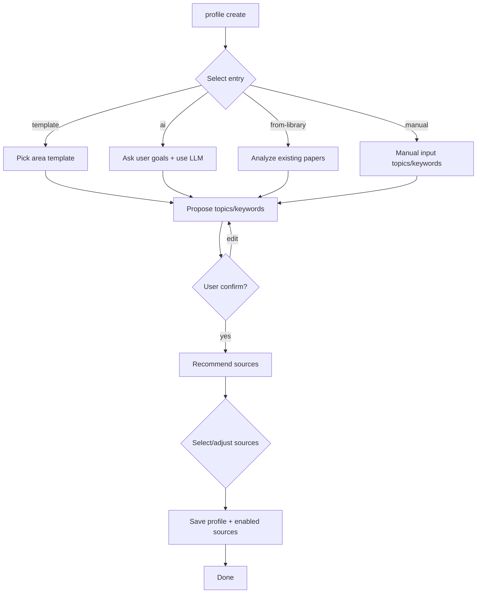

# Paper Agent v01_source Functional Spec（功能规格说明）

## 1. 基本信息
- 功能名称：Paper Agent v01_source Functional Spec (Source/Profile Extension)
- Base Spec（v01）：`docs/v01/spec.md`
- 对应 Requirement：`docs/v01_source/requirement.md`
- 文档负责人：Paper Agent Team
- 日期：2026-03-12
- 版本：v01_source
- 状态：草稿

---

## 2. 功能概述

本规格文档定义 v01 的增量扩展能力：

- **Profile**：引导式生成/维护 topics/keywords，并把 sources 推荐/选择纳入流程
- **Sources**：Source Registry + CLI 管理（list/show/enable/disable/add/config）
- **Multi-source Collect**：arXiv + OpenReview + DBLP + ACL Anthology 的真实抓取与入库
- **Error Recovery**：单源失败不阻断整体；结构化错误输出与可重试

不重复定义 v01 中已覆盖的 digest/search/report 等行为；本扩展只补足“如何获得可靠输入与更完整来源覆盖”。

---

## 3. CLI 命令契约（MVP）

### 3.1 全局约定

- 所有命令支持 `--json`：输出结构化 JSON，适用于 automation agent。
- 未指定 `--json` 时：输出 human-readable 文本。
- 错误码（建议统一，详见 8.3）：
  - `0`：成功
  - `2`：用户输入错误（参数不合法）
  - `3`：未初始化（缺 config）
  - `4`：配置不完整（例如 profile 未完成且命令不允许 explore）
  - `10`：部分成功（multi-source 部分源失败）
  - `11`：外部依赖失败（网络/API/解析）

[待确认] v01 现有命令返回码策略是否已固定；若未固定，v01_source 将作为统一错误码的落地起点。

### 3.2 `paper-agent init`（LLM-only）

**目的**：仅完成基础设施初始化（LLM provider / key / model / base_url / data_dir）。

- 输入：交互式（或未来可支持 flag）
- 输出：
  - 文本：成功提示 + 下一步 `paper-agent profile create`
  - JSON：
    ```json
    {"status":"ok","initialized":true,"profile_completed":false}
    ```

### 3.3 `paper-agent profile ...`

#### 3.3.1 `paper-agent profile create`

**目的**：创建/更新 profile，生成 topics/keywords，并推荐 sources。

**交互分支（入口选择）**：
1. 模板（template）
2. AI 分析（ai）
3. 从已收集论文学习（from-library）
4. 手动（manual）

**参数（MVP 建议）**：
- `--json`：输出最终 profile（以及 sources 选择结果）
- `--non-interactive`：[待确认] 是否需要支持；MVP 可先不做

**输出（JSON 示例）**：
```json
{
  "status": "ok",
  "profile": {
    "topics": ["retrieval-augmented generation", "reranking"],
    "keywords": ["retrieval planning", "dense retriever"],
    "created_at": "2026-03-12T00:00:00Z"
  },
  "recommended_sources": [
    {"id":"arxiv:cs.IR","enabled":true},
    {"id":"openreview:NeurIPS","enabled":true}
  ]
}
```

**错误**：
- 未初始化：提示先 init
- LLM 不可用（AI 入口）：返回错误并允许用户退回选择其他入口

### 3.4 `paper-agent sources ...`

#### 3.4.1 `paper-agent sources list`
- 输出内置 sources + 用户自定义 sources
- 支持 `--json`

JSON 示例：
```json
{
  "status": "ok",
  "sources": [
    {"id":"arxiv:cs.AI","type":"arxiv_category","enabled":true},
    {"id":"openreview:ICLR","type":"openreview_venue","enabled":false}
  ]
}
```

#### 3.4.2 `paper-agent sources show <id>`
- 输出该 source 的完整定义：类型、抓取参数、显示名、默认建议等

#### 3.4.3 `paper-agent sources enable <id...>` / `disable <id...>`
- 变更启用状态并持久化
- 对未知 id：返回输入错误 + 提示可用 id（或提示使用 `sources list`）

#### 3.4.4 `paper-agent sources add`
- 添加自定义源定义（RSS/自定义 URL 等）
- MVP：只做“可配置 + 可列举”，抓取可后续版本

#### 3.4.5 `paper-agent sources config`
- MVP 选项：
  - `--print`：打印当前 sources 覆盖层（YAML）
  - `--set key=value`：设置关键项（如 enabled list）

[待决策] 是否提供“打开编辑器”能力；MVP 可不做。

---

## 4. Profile 引导交互（分支流程）

### 4.1 状态机（配置完成度）

- `initialized=false`：无 config
- `initialized=true, profile_completed=false`：仅完成 init
- `initialized=true, profile_completed=true`：完成 profile

### 4.2 profile create 流程



### 4.3 Source 推荐逻辑

优先级：
1. **规则模板推荐**（deterministic, reproducible）
2. **可选 LLM 推荐**（补充来源或会议/分类映射）

推荐输入：
- topics/keywords
- 选择的领域模板（若有）
- 已启用 sources（避免重复推荐）

推荐输出：
- 一个 source id 列表（含原因/标签）

[待确认] LLM 推荐是否默认关闭（建议默认关闭，避免成本与不稳定）。

---

## 5. 多源抓取行为（MVP）

### 5.1 统一行为约定

- 每个 source adapter 输出 `Paper`：
  - `source_name`: `arxiv` / `openreview` / `dblp` / `acl`
  - `canonical_key`: 按来源命名空间稳定生成，用于去重
  - `source_paper_id`: 来源内 id（如 arXiv id、OpenReview note id）

canonical_key 规则：
- arXiv：`arxiv:{id}`
- OpenReview：`openreview:{note_id}`
- DBLP：`dblp:{key}`
- ACL Anthology：`acl:{anthology_id}`

### 5.2 arXiv

- 输入：分类（如 `cs.AI`）+ `days_back` + `max_results`
- 行为：分页抓取 Atom API

### 5.3 OpenReview

- 输入：venue（NeurIPS/ICML/ICLR）+ year/period
- 行为（建议）：
  - 基于 OpenReview API 拉取 notes
  - [待确认] invitation 的稳定性：不同年份 venue 的 invitation pattern 可能不同

### 5.4 DBLP

- 输入：venue_key（例如 conf/aaai）+ year
- 行为：
  - DBLP API 获取 publication 列表
  - abstract 缺失：置空 abstract；后续 filtering/digest 必须允许 abstract 为空（降级策略）

### 5.5 ACL Anthology

- 输入：venue（ACL/EMNLP/NAACL）+ year
- 行为：
  - 获取/解析 Anthology 的 Bib/JSON 元数据
  - 对解析失败项：记录为 source error，跳过该条

---

## 6. 去重/合并策略

### 6.1 去重

- 以 `canonical_key` 作为强唯一键（storage 已有 UNIQUE 约束）
- 同一来源重复：直接计为 duplicate

### 6.2 跨来源合并（MVP 策略）

MVP 仅做“强 key 去重”，不尝试跨来源同一论文的合并（例如 arXiv 与 ACL 同一论文）。

[待决策] 后续版本可引入：
- DOI 归一
- title+authors+year 的模糊匹配

---

## 7. 错误与恢复

### 7.1 Multi-source collect 的部分失败

- 任何单源失败：
  - 该源结果记为 `failed`
  - 整体 collect 仍继续其他源
  - 最终整体返回码为 `10`（partial success）

### 7.2 Error Recovery Table

| 场景 | 可能原因 | 系统行为 | 用户可执行动作 |
|---|---|---|---|
| 单源超时/限流 | 网络/429 | 重试（指数退避，有限次数），最终失败则记录 | 重试 collect；降低 max；延长 timeout |
| OpenReview 返回结构变化 | API schema 变动 | 解析失败计入 error summary | 更新版本/适配器；临时禁用该 source |
| DBLP 返回结构变化 | API schema 变动 | 同上 | 同上 |
| ACL Anthology 解析失败 | 格式变动/异常条目 | 跳过条目 + 记录 | 重试；报告 issue；临时禁用 |
| 配置缺失（未 profile） | profile 未完成 | 提示 profile create；允许 `--explore` | `profile create` 或 `collect --explore` |

### 7.3 collect 在未 profile 时的门槛

- 默认：若 `profile_completed=false`，collect 提示先 profile。
- 允许：`collect --explore`（宽泛收集）
  - explore 模式下：使用 sources 的默认推荐集合（或 minimal default）

[待确认] explore 模式的默认 sources 选择。

---

## 8. 验收标准（Acceptance Criteria）

### AC-SRC-01 init 不强制 topics/keywords/sources
- Given：用户首次安装 Paper Agent
- When：用户执行 `paper-agent init`
- Then：系统仅要求 LLM provider/key 等基础设施信息
- And：配置状态标记 `profile_completed=false`

### AC-SRC-02 profile create 可生成 topics/keywords 并保存
- Given：用户已完成 init
- When：用户执行 `paper-agent profile create` 并完成确认
- Then：配置中写入 topics/keywords
- And：profile_completed=true

### AC-SRC-03 sources list/show/enable/disable 可用
- Given：用户已完成 init
- When：用户执行 `paper-agent sources list`
- Then：输出包含 arXiv/OpenReview/DBLP/ACL Anthology 的 sources 定义

### AC-SRC-04 多源 collect 可真实抓取并入库
- Given：用户启用了 arXiv + OpenReview + DBLP + ACL sources
- When：用户执行 `paper-agent collect`
- Then：四类来源均产生入库记录（source_name/canonical_key 正确）

### AC-SRC-05 单源失败不阻断整体
- Given：OpenReview source 返回超时
- When：用户执行 multi-source collect
- Then：arXiv/DBLP/ACL 仍继续并成功入库
- And：输出 error_summary 包含 OpenReview 失败原因

---

## 9. 未决问题

- [待确认] OpenReview venue 与年份/track invitation 的稳定性（NeurIPS/ICML/ICLR 不同年份可能不一致）
- [待确认] ACL Anthology 的可用数据格式（Bib/JSON）与解析鲁棒性
- [待确认] DBLP 缺 abstract 的情况下，Filtering/Digest 的最低可用策略
- [待决策] sources.yaml 的“内置默认 + 用户覆盖”合并策略（落在 config.yaml 还是独立文件）
