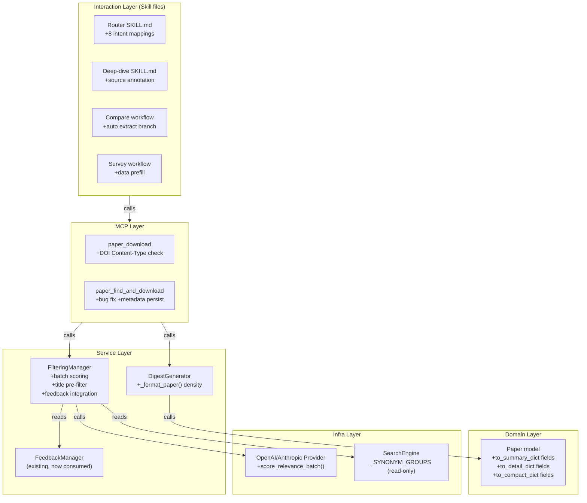

# Paper Agent v04-experience — Technical Design Doc

**Phase:** Phase 3 (技术设计)
**Last Updated:** 2026-03-15
**项目知识参考：** `docs/architecture/adr/ADR-003` (交互层/数据层分离), `docs/architecture/adr/ADR-004` (Workspace Layer)

---

## 1. 变更范围概览

v04-experience 不新增模块，仅修改现有模块。变更文件清单：

| 模块 | 文件 | 变更类型 | 复杂度 |
|------|------|---------|--------|
| Domain Model | `domain/models/paper.py` | 修改 3 个方法 | 低 |
| Digest | `services/digest_generator.py` | 修改 `_format_paper()` | 低 |
| Filtering | `services/filtering_manager.py` | 新增 batch scoring + 预过滤 + feedback 集成 | 高 |
| LLM | `infra/llm/openai_provider.py` | 新增 `score_relevance_batch()` | 中 |
| LLM | `infra/llm/anthropic_provider.py` | 新增 `score_relevance_batch()` | 中 |
| MCP Tools | `mcp/tools.py` | 修改 `paper_download`, `paper_find_and_download` | 中 |
| Skills | `cli/_skill_content.py` | 更新 ROUTER_SKILL 意图映射 + 条件分支 | 低 |
| Skills | `plugin/claude-code/skills/*.md` | 同步 _skill_content.py 的变更 | 低 |
| Skills | `plugin/claude-code/commands/*.md` | 同步变更 | 低 |

---

## 2. C4 Level 3 — Component 变更图

v04-experience 在已有 Component 架构上的修改点：



---

## 3. 函数契约

### 3.1 Paper.to_summary_dict() — 修改

```python
def to_summary_dict(self) -> dict[str, Any]:
    """
    Pre: self 是有效的 Paper 对象
    Post: 返回 dict 包含原有 8 字段 + 新增 3 字段
    新增: reading_status (str|None), canonical_key (str), source_paper_id (str)
    不变量: 所有字段值来自 self 属性，无外部调用
    复杂度: O(1)
    """
```

### 3.2 Paper.to_detail_dict() — 修改

```python
def to_detail_dict(self) -> dict[str, Any]:
    """
    Pre: self 是有效的 Paper 对象
    Post: 返回 dict 包含原有字段 + 新增 8 字段
    新增: reading_status, canonical_key, source_paper_id, created_at,
          pdf_url (from metadata), doi (from metadata),
          citation_count (from metadata), venue (from metadata)
    不变量: metadata 中缺失的字段返回 None
    复杂度: O(1)
    """
```

### 3.3 Paper.to_compact_dict() — 修改

```python
def to_compact_dict(self) -> dict[str, Any]:
    """
    Pre: self 是有效的 Paper 对象
    Post: 返回 dict 包含原有字段 + 新增 methodology_tags
    复杂度: O(1)
    """
```

### 3.4 DigestGenerator._format_paper() — 修改

```python
def _format_paper(self, idx: int, paper: Paper) -> list[str]:
    """
    Pre: paper 是评分后的 Paper 对象, idx >= 1
    Post: 返回 markdown 行列表，包含:
      - title, score, source_name, published_at, canonical_key (条件展示)
      - authors, topics (条件展示), methodology_tags (条件展示)
      - recommendation_reason, abstract[:300]
    不变量: 空字段不展示对应行，不报错
    复杂度: O(1)
    """
```

### 3.5 OpenAIProvider.score_relevance_batch() — 新增

```python
def score_relevance_batch(
    self, papers: list[Paper], interests: dict[str, Any]
) -> list[dict[str, Any]]:
    """
    Pre: len(papers) >= 1 and len(papers) <= 10
         interests 含 "topics" 和 "keywords"
    Post: 返回 list[dict]，长度 == len(papers)
          每个 dict 包含 {score: float, band: str, reason: str, topics: list[str]}
    异常: JSONDecodeError | ValueError → 返回每篇 {score:0, band:"low", reason:"batch解析失败"}
    复杂度: O(1) LLM 调用（1 次 API call）
    设计模式: 与 score_relevance() 共用 prompt 结构，batch 扩展
    """
```

### 3.6 FilteringManager._pre_filter() — 新增

```python
def _pre_filter(
    self, papers: list[Paper], interests: dict[str, Any]
) -> tuple[list[Paper], list[Paper]]:
    """
    Pre: papers 非空, interests 含 topics + keywords
    Post: 返回 (needs_llm, pre_filtered)
          needs_llm: title/abstract 命中关键词的论文
          pre_filtered: 未命中的论文（已标记 score=1.0, band="low"）
    不变量: needs_llm + pre_filtered == papers (无遗漏)
    复杂度: O(P * K) 其中 P=论文数, K=关键词数（含同义词）
    """
```

### 3.7 FilteringManager._apply_feedback_offset() — 新增

```python
def _apply_feedback_offset(
    self, papers: list[Paper]
) -> None:
    """
    Pre: papers 已有 relevance_score
    Post: 每篇论文的 relevance_score 已加上 feedback 偏移
          偏移量 clamp 在 [-2.0, +2.0]
          最终 score clamp 在 [0.0, 10.0]
    异常: FeedbackManager 不可用 → 跳过（log warning），papers 不变
    复杂度: O(P * T) 其中 T=feedback topic 数
    """
```

---

## 4. ADR

### ADR-005: Batch Scoring 策略

见 `docs/architecture/adr/ADR-005-batch-scoring.md`（待创建）。

**核心决策**：在 FilteringManager 中引入 batch scoring（一次 LLM 调用评估多篇论文），保留逐篇 fallback。

**选项**：
- A: 保持逐篇并行 → 性能已接近瓶颈（受 rate limit 和 max_workers=8 限制）
- B: Batch prompt（5-8 篇/次）→ 减少 API 调用次数 60%+，总延迟下降
- C: 两阶段评分（粗筛→精筛）→ 复杂度高

**决策**：选 B。理由：实现简单，兼容现有 provider 接口，fallback 逻辑清晰。

### ADR-006: Feedback 闭环策略

见 `docs/architecture/adr/ADR-006-feedback-loop.md`（待创建）。

**核心决策**：FeedbackManager 的 topic_adjustments 作为 score 偏移量集成到 FilteringManager。

**选项**：
- A: 在 LLM prompt 中注入偏好 → 影响 LLM 评分结果但不可控
- B: LLM 评分后做 score 偏移 → 可控、可调、可审计
- C: 在 DigestGenerator 排序时偏移 → 只影响 digest，不影响其他消费者

**决策**：选 B。理由：在 FilteringManager 中统一偏移，所有消费者（digest, recommend, triage）都受益；偏移量可审计。

---

## 5. 变更影响分析

### 5.1 受影响的已有模块

| 变更项 | 受影响模块 | 影响类型 | 回归测试要求 |
|--------|----------|---------|------------|
| `to_summary_dict()` 新增字段 | 所有调用 `to_summary_dict()` 的 MCP 工具 | 向后兼容（新增字段） | 验证返回值格式 |
| `to_detail_dict()` 新增字段 | `paper_show`, `paper_batch_show` | 向后兼容 | 验证返回值格式 |
| `to_compact_dict()` 新增字段 | `paper_compare`, `paper_quick_scan` | 向后兼容 | 验证返回值格式 |
| `_format_paper()` 格式变化 | `DigestGenerator._save_artifact()` | 格式变化 | 验证 digest markdown 可读性 |
| `filter_papers()` 新增 batch + prefilter | `paper_collect`, `paper_morning_brief` | 行为变化 | scoring 结果对比（batch vs serial 一致性） |
| `paper_download` DOI 检查 | 下载工具 | 行为增强 | 下载成功率测试 |
| `paper_find_and_download` bug fix | 查找下载工具 | Bug fix | Paper 创建 + metadata 持久化 |
| Router Skill 新增映射 | IDE 交互 | 新增路由 | 意图测试 |

### 5.2 接口兼容性声明

| 接口 | 兼容策略 |
|------|---------|
| `to_summary_dict()` | 向后兼容：新增 3 个字段，不删除/修改已有字段 |
| `to_detail_dict()` | 向后兼容：新增 8 个字段 |
| `to_compact_dict()` | 向后兼容：新增 1 个字段 |
| `filter_papers()` | 向后兼容：签名不变，内部逻辑变化 |
| `_format_paper()` | 格式变化：digest 输出多了行，但 markdown 结构不变 |
| `score_relevance_batch()` | 新增方法，不影响 `score_relevance()` |

### 5.3 回归测试计划

| # | 场景 | 验证内容 |
|---|------|---------|
| RT-01 | `paper_search` 返回结果 | `to_summary_dict()` 含新增字段 |
| RT-02 | `paper_show` 返回结果 | `to_detail_dict()` 含新增字段 |
| RT-03 | `paper_morning_brief` 完整流程 | digest 含增强信息，scoring 使用 batch |
| RT-04 | 200 篇 scoring 性能 | batch 模式 ≤ 逐篇模式 40% |
| RT-05 | batch scoring LLM 失败 | fallback 到逐篇模式，无挂起 |
| RT-06 | feedback 后 digest 排序 | 偏好 topic 的论文排序变化 |
| RT-07 | `paper_download` 非 arXiv 论文 | fallback 链正确执行 |
| RT-08 | `paper_find_and_download` S2 论文 | Paper 创建成功 + metadata 持久化 |
| RT-09 | Router Skill 新增意图 | "我的偏好" → paper_preferences |
| RT-10 | Workspace digest 文件 | 增强格式不破坏 WorkspaceManager |

---

## 6. 追溯矩阵更新 (Phase 3 补充)

见 `docs/v04-experience/traceability-matrix.md` — 补充 Component, API 列。
