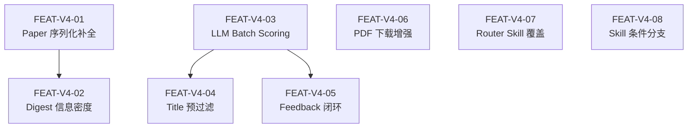

# Paper Agent v04-experience — 特性清单

**Phase:** Phase 4 (特性拆解)
**Last Updated:** 2026-03-15

---

## 特性清单

| FEAT-ID | 名称 | 粒度 | Priority | 依赖 | Sprint |
|---------|------|------|----------|------|--------|
| FEAT-V4-01 | Paper 序列化补全 | 粗 | P0 | — | S1 |
| FEAT-V4-02 | Digest 信息密度提升 | 粗 | P0 | FEAT-V4-01 | S1 |
| FEAT-V4-03 | LLM Batch Scoring | 细 | P0 | — | S1 |
| FEAT-V4-04 | Title 预过滤 | 粗 | P1 | FEAT-V4-03 | S1 |
| FEAT-V4-05 | Feedback 闭环 | 细 | P1 | FEAT-V4-03 | S2 |
| FEAT-V4-06 | PDF 下载增强 + Bug Fix | 粗 | P1 | — | S2 |
| FEAT-V4-07 | Router Skill 未引用工具覆盖 | 粗 | P0 | — | S1 |
| FEAT-V4-08 | Skill 条件分支优化 | 粗 | P1 | — | S2 |

---

## 粒度分级判定

### FEAT-V4-01: Paper 序列化补全 → **粗粒度**

| 维度 | 判定 |
|------|------|
| 业务逻辑 | 标准字段添加，无分支 |
| 算法密集度 | 无 |
| 风险等级 | 低（向后兼容） |
| 模块耦合度 | 单模块（Paper model） |
| 可逆性 | 高（可随时移除字段） |
| **结论** | 0 个命中细粒度 → 粗粒度 |

### FEAT-V4-02: Digest 信息密度提升 → **粗粒度**

| 维度 | 判定 |
|------|------|
| 业务逻辑 | 条件展示逻辑（字段为空则跳过） |
| 算法密集度 | 无 |
| 风险等级 | 低（格式变化可回滚） |
| 模块耦合度 | 单模块（DigestGenerator） |
| 可逆性 | 高 |
| **结论** | 0 个命中 → 粗粒度 |

### FEAT-V4-03: LLM Batch Scoring → **细粒度**

| 维度 | 判定 |
|------|------|
| 业务逻辑 | batch 分组 + fallback + 并行 → 分支多 |
| 算法密集度 | LLM prompt 构建 + JSON 解析 |
| 风险等级 | 中（评分质量影响推荐准确性） |
| 模块耦合度 | 跨模块（FilteringManager + LLMProvider） |
| 可逆性 | 高（可降级回逐篇） |
| **结论** | 3 个命中 → 细粒度 |

### FEAT-V4-04: Title 预过滤 → **粗粒度**

| 维度 | 判定 |
|------|------|
| 业务逻辑 | 关键词匹配，逻辑简单 |
| 算法密集度 | 字符串匹配 + 同义词展开 |
| 风险等级 | 低（可关闭） |
| 模块耦合度 | 单模块内部（FilteringManager） |
| 可逆性 | 高（配置关闭） |
| **结论** | 0 个命中 → 粗粒度 |

### FEAT-V4-05: Feedback 闭环 → **细粒度**

| 维度 | 判定 |
|------|------|
| 业务逻辑 | 偏好读取 + 偏移计算 + clamp + 排序影响 |
| 算法密集度 | 权重计算 |
| 风险等级 | 中（偏移不当会影响推荐质量） |
| 模块耦合度 | 跨模块（FilteringManager + FeedbackManager） |
| 可逆性 | 中（偏好已影响历史评分） |
| **结论** | 3 个命中 → 细粒度 |

### FEAT-V4-06: PDF 下载增强 + Bug Fix → **粗粒度**

| 维度 | 判定 |
|------|------|
| 业务逻辑 | fallback 链 + Content-Type 检查 |
| 算法密集度 | 无 |
| 风险等级 | 低（增强，不改已有成功路径） |
| 模块耦合度 | 单模块（mcp/tools.py） |
| 可逆性 | 高 |
| **结论** | 0 个命中 → 粗粒度 |

### FEAT-V4-07: Router Skill 未引用工具覆盖 → **粗粒度**

| 维度 | 判定 |
|------|------|
| 业务逻辑 | 意图映射表追加 |
| 算法密集度 | 无 |
| 风险等级 | 低 |
| 模块耦合度 | 单文件（Skill 文本） |
| 可逆性 | 高 |
| **结论** | 0 个命中 → 粗粒度 |

### FEAT-V4-08: Skill 条件分支优化 → **粗粒度**

| 维度 | 判定 |
|------|------|
| 业务逻辑 | Skill 文本中添加自然语言条件分支 |
| 算法密集度 | 无 |
| 风险等级 | 低（Skill 文本变更可回滚） |
| 模块耦合度 | Skill 文件 |
| 可逆性 | 高 |
| **结论** | 0 个命中 → 粗粒度 |

---

## 依赖 DAG

无环。FEAT-V4-06、V4-07、V4-08 无依赖，可并行。

---

## 迭代计划

### Sprint 1: 核心体验 (FEAT-V4-01 + 02 + 03 + 04 + 07)

| 任务 | 说明 | 预估 |
|------|------|------|
| Paper.to_summary_dict/to_detail_dict/to_compact_dict 补全 | 新增字段 | 0.5h |
| DigestGenerator._format_paper() 增强 | 新增展示字段 | 0.5h |
| OpenAIProvider.score_relevance_batch() | batch prompt + JSON 解析 | 2h |
| AnthropicProvider.score_relevance_batch() | 同上 | 1h |
| FilteringManager batch + pre-filter 重构 | 核心逻辑变更 | 3h |
| Router Skill 新增 8 个意图映射 | 文本编辑 | 0.5h |
| _skill_content.py 同步 | 文本同步 | 0.5h |

**Sprint 1 总估时**：~8h

### Sprint 2: 闭环 + 下载 + 分支优化 (FEAT-V4-05 + 06 + 08)

| 任务 | 说明 | 预估 |
|------|------|------|
| FilteringManager feedback 集成 | 读取 FeedbackManager + 偏移计算 | 2h |
| AppContext 注入 FeedbackManager 到 FilteringManager | 依赖注入 | 0.5h |
| paper_download DOI Content-Type 检查 | HTTP HEAD + 检查 | 1h |
| paper_find_and_download bug fix + metadata persist | 参数修复 + metadata | 0.5h |
| Skill 条件分支：Deep-dive 信息来源标注 | 文本编辑 | 0.5h |
| Skill 条件分支：Compare auto-extract | 文本编辑 | 0.5h |
| Skill 条件分支：Survey 数据预填充 | 文本编辑 | 0.5h |
| plugin/ 目录同步 | 文件同步 | 0.5h |

**Sprint 2 总估时**：~6h

---

## 四可检验

### FEAT-V4-01: Paper 序列化补全

| 检验项 | 结论 |
|--------|------|
| 可感知 | 用户调用 paper_show 后看到 reading_status、canonical_key、doi 等新字段 |
| 可演示 | paper_show(paper_id) → 返回值含新字段 |
| 可端到端 | 论文入库 → paper_show → 新字段可见 |
| 可独立上线 | 不依赖其他 FEAT |

### FEAT-V4-02: Digest 信息密度提升

| 检验项 | 结论 |
|--------|------|
| 可感知 | 用户看到 digest 中每篇论文有 topics、methods、日期、来源等信息 |
| 可演示 | paper_morning_brief → digest markdown 包含增强字段 |
| 可端到端 | 收集 → 评分 → digest 生成 → 增强字段可见 |
| 可独立上线 | 依赖 FEAT-V4-01（同 Sprint） |

### FEAT-V4-03: LLM Batch Scoring

| 检验项 | 结论 |
|--------|------|
| 可感知 | 用户感知评分速度提升（200 篇 ≤ 2 分钟 vs 之前 5 分钟） |
| 可演示 | paper_collect → scoring → 计时对比 |
| 可端到端 | 收集 → batch scoring → digest → 评分结果一致 |
| 可独立上线 | 不依赖其他 FEAT |

### FEAT-V4-04: Title 预过滤

| 检验项 | 结论 |
|--------|------|
| 可感知 | 用户感知评分速度进一步提升 + 日志中可见 [pre-filtered] |
| 可演示 | 200 篇收集 → 预过滤跳过 N 篇 → LLM 只评其余 |
| 可端到端 | 收集 → 预过滤 → batch scoring → digest |
| 可独立上线 | 依赖 FEAT-V4-03（同 Sprint） |

### FEAT-V4-05: Feedback 闭环

| 检验项 | 结论 |
|--------|------|
| 可感知 | 用户 feedback "太高了" → 下次 digest 中同类论文排序下降 |
| 可演示 | feedback → digest → 排序变化可见 |
| 可端到端 | feedback 记录 → 偏好计算 → scoring 偏移 → digest 排序 |
| 可独立上线 | 依赖 FEAT-V4-03（不同 Sprint，但 V4-03 先完成） |

### FEAT-V4-06: PDF 下载增强 + Bug Fix

| 检验项 | 结论 |
|--------|------|
| 可感知 | 用户下载非 arXiv 论文成功率提升 |
| 可演示 | paper_download(非 arXiv 论文) → fallback 到 S2 PDF → 下载成功 |
| 可端到端 | 搜索论文 → 下载 → PDF 文件存在 |
| 可独立上线 | 不依赖其他 FEAT |

### FEAT-V4-07: Router Skill 未引用工具覆盖

| 检验项 | 结论 |
|--------|------|
| 可感知 | 用户说"我的偏好" → 系统返回偏好总结 |
| 可演示 | 多个意图测试 → 正确路由 |
| 可端到端 | 自然语言 → Router 识别 → 工具调用 → 结果返回 |
| 可独立上线 | 不依赖其他 FEAT |

### FEAT-V4-08: Skill 条件分支优化

| 检验项 | 结论 |
|--------|------|
| 可感知 | 用户分析论文时看到 [基于全文] 或 [基于摘要] 标注 |
| 可演示 | 分析有 PDF 的论文 → [基于全文]；分析无 PDF 的 → [基于摘要] |
| 可端到端 | 论文分析 → 条件分支执行 → 标注可见 |
| 可独立上线 | 不依赖其他 FEAT |
