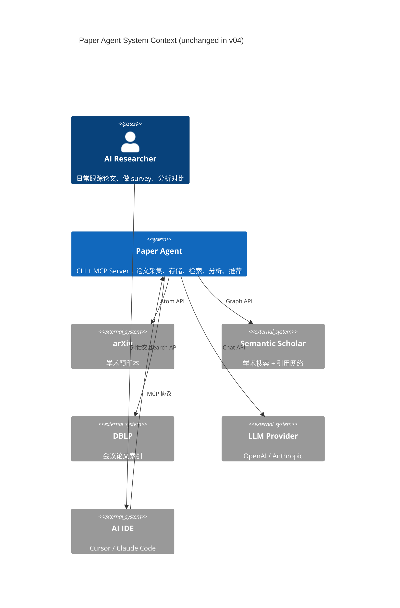

# Paper Agent v04-experience — Vision

**Phase:** Phase 0 (想法澄清)
**Status:** Draft
**Last Updated:** 2026-03-15
**Baseline:** `../v03/feature-list.md`, `../v02/vision.md`

---

## 1. 愿景陈述

> Paper Agent v04-experience 解决一个核心矛盾：**系统已具备 50+ MCP 工具（含 PDF 全文解析、结构化抽取、可信度评估、反馈学习、研究规划等高级能力），但面向用户的 Skills/Commands 仍停留在 v02 水平，仅引用 15 个基础工具——70% 的能力对用户完全不可见。** 本版本通过 Skill 层全面升级、输出质量提升、工作流摩擦消除和反馈闭环建立，让研究者真正感受到从"论文搜索工具"到"AI 研究伙伴"的体验跃迁。

### 1.1 v03 → v04-experience 的核心跃迁

| | v03 (已实现) | v04-experience (本版本) |
|---|---|---|
| **工具层** | 50+ MCP 工具（v01-v06 全实现） | 不新增工具，专注"让已有工具被用户触达" |
| **Skill 层** | 6 个 SKILL.md 仍引用 v02 工具 | Skill 全面升级，按条件分支引用 v03-v06 工具 |
| **输出质量** | 模板精美但 AI 自由填充 | 工具预填充结构化数据，AI 只做分析和叙述 |
| **信息密度** | summary_dict 缺 6 个关键字段 | 补全 reading_status、citation_count、canonical_key 等 |
| **工作流** | 多步编排依赖 AI 猜测 | 条件分支明确：有 PDF → 自动 parse → extract |
| **性能** | LLM scoring 逐篇串行 | Batch scoring + title 预过滤 |
| **反馈闭环** | feedback/watch 工具存在但不影响推荐 | 偏好影响 digest 和 filter 权重 |
| **下载能力** | 仅 arXiv PDF | fallback 到 S2 openAccessPdf + DOI |

---

## 2. C4 Context 图

v04-experience 不改变系统边界和外部参与者。C4 Context 与 v01 一致：



**v04-experience 的变化全部发生在 Paper Agent 内部**——Skill 层、序列化层、FilteringManager、DigestGenerator。不新增外部系统交互。

---

## 3. 用户旅程图

### 3.1 v04-experience 改进前后对比旅程

```
阶段            触点                   v03 行为                          v04 行为                          情感变化
─────────────────────────────────────────────────────────────────────────────────────────────────────────────
① 每日开工     /start-my-day          3 步编排 (context→collect→digest)  1 步 morning_brief               😟→😊
                                      digest 只有 title+score+abstract  digest 含 method_tag+citation     😐→😊
                                                                        count+credibility+关联说明

② 论文分析     "分析这篇论文"          只看 abstract，AI 自由发挥         自动检测 PDF → parse → extract    😟→😃
                                      无可信度评估                       → 基于全文分析 + credibility
                                      不知道 paper_ask 存在              → 用户可追问论文任意问题

③ 论文对比     "对比这 5 篇"           paper_compare 只搬运 metadata     自动 extract → compare_table      😟→😃
                                      methodology_tags 大多为空          → 结构化 task/method/dataset 对比
                                                                        → AI 基于硬数据做分析叙述

④ 文献综述     "做个 survey"           模板字段全靠 AI 猜                 paper_trend_data 预填充趋势       😐→😊
                                      方法分类无数据支撑                  paper_field_stats 预填充分布
                                                                        → AI 基于结构化数据写综述

⑤ 推荐反馈     标记"太高了/太低了"      feedback 记录但无效果              偏好影响下次 digest 权重          😟→😊
                                      watchlist 不进入晨报               watchlist 自动集成 morning_brief

⑥ 下载论文     "下载这 10 篇"         非 arXiv 论文直接 skip            fallback S2 openAccessPdf + DOI   😡→😊
                                      成功率 ~50%                        成功率 ~80%

⑦ 发现能力     "还能做什么？"          用户不知道 credibility/ideate     router skill 覆盖所有意图映射      😐→😃
                                      等高级功能存在                      paper_health 展示能力清单
```

### 3.2 情感曲线

```
满意度
  5 ┤                                    ④★ ──── ⑤★
  4 ┤              ②★ ──── ③★ ─────────┘
  3 ┤    ①★ ─────┘                                          v04 (改进后)
  2 ┤
  1 ┤─①──────②──────③──────④──────⑤──────⑥──────⑦───       v03 (改进前)
  0 ┤
    └──────────────────────────────────────────────────→ 旅程阶段
```

---

## 4. 用户故事地图

```
Activity: 日常论文 Intake
├── Task: 每日开工
│   ├── US-V4-01: 作为研究者，我希望一步完成晨报，不需要分别调用 3 个工具
│   ├── US-V4-02: 作为研究者，我希望 digest 中看到被引数和方法标签，快速判断重要性
│   └── US-V4-03: 作为研究者，我希望 watchlist 更新自动出现在晨报中
│
├── Task: 论文筛选
│   ├── US-V4-04: 作为研究者，我希望 scoring 速度更快，200 篇不要等 5 分钟
│   └── US-V4-05: 作为研究者，我希望系统记住我的偏好调整，下次推荐更准
│
└── Task: 下载论文
    └── US-V4-06: 作为研究者，我希望非 arXiv 论文也能下载 PDF

Activity: 深度研究
├── Task: 单篇深入分析
│   ├── US-V4-07: 作为研究者，当论文有 PDF 时，我希望系统自动解析全文做深度分析
│   ├── US-V4-08: 作为研究者，我希望分析报告标注信息来源（"基于全文" vs "基于摘要"）
│   └── US-V4-09: 作为研究者，我希望能对论文提任意问题（"损失函数是什么？"）
│
├── Task: 多篇对比
│   ├── US-V4-10: 作为研究者，我希望对比表包含 task/method/dataset/metric 等结构化字段
│   └── US-V4-11: 作为研究者，我希望对比前系统自动提取论文 profile，不需要手动触发
│
├── Task: 文献综述
│   ├── US-V4-12: 作为研究者，我希望综述中的趋势数据基于统计而非 AI 猜测
│   └── US-V4-13: 作为研究者，我希望综述中的方法分类基于 field_stats 而非 AI 推断
│
└── Task: 可信度评估
    └── US-V4-14: 作为研究者，我希望分析论文时自动评估其可信度和可复现性

Activity: 能力发现与个性化
├── Task: 发现高级功能
│   ├── US-V4-15: 作为研究者，我希望说"有什么 idea"时系统能路由到 paper_ideate
│   ├── US-V4-16: 作为研究者，我希望说"可信吗"时系统能路由到 paper_credibility
│   └── US-V4-17: 作为研究者，我希望说"帮我追踪这个作者"时系统能路由到 paper_watch
│
└── Task: 偏好反馈
    ├── US-V4-18: 作为研究者，我希望反馈"评分太高"后下次推荐权重真的变化
    └── US-V4-19: 作为研究者，我希望看到系统学到的偏好总结
```

---

## 5. 范围边界表

| 类别 | 内容 |
|------|------|
| **In Scope (v04-experience)** | ① Skill/Commands 全面升级（6 个 SKILL.md + router + `_skill_content.py` 同步引用 v03-v06 工具）· ② Paper 序列化补全（reading_status, canonical_key, citation_count, pdf_url, created_at）· ③ Digest 信息密度提升（methodology_tags, citation_count, credibility hint）· ④ Deep-dive 全文自动链路（检测 PDF → parse → extract → 基于全文分析）· ⑤ Compare 自动 extract 链路 · ⑥ LLM Batch Scoring（5-10 篇/批 + title 预过滤）· ⑦ PDF 下载 fallback（S2 openAccessPdf + DOI resolver）· ⑧ Feedback 闭环（偏好影响 digest 和 filter 权重）· ⑨ Watchlist 集成 morning_brief · ⑩ Router Skill 扩展意图映射（credibility, ideate, watch, experiment_plan, reading_pack）· ⑪ Survey/Insight 报告数据预填充（trend_data, field_stats）|
| **Out of Scope** | 新增 MCP 工具 · 语义搜索（需 embedding pipeline，延后）· Survey 增量更新 · Web UI · 团队协作 · 新增论文来源 · 结构化笔记分类 |
| **Future (v05+)** | 语义搜索 (embedding + hybrid search) · Survey 增量更新 · 进度仪表盘（周/月视角）· 作者搜索工具 · 论文关联发现（find similar）· 研究意图持久化 (research session) |

---

## 6. 干系人地图

| 角色 | 关注点 | 参与阶段 | 沟通频率 |
|------|--------|---------|---------|
| AI Researcher (主要) | 能力可达性、输出报告质量、深度分析能力、推荐准确性 | 需求→验收 | 每日使用 |
| PhD Student / Early Researcher | survey 数据支撑、对比表结构化、论文下载成功率 | 需求→验收 | 每日使用 |
| AI IDE (Cursor/Claude Code) | Skill 文件正确引导工具调用链、条件分支清晰 | 设计→集成 | 每次会话 |
| 开发者 (self) | 向后兼容、Skill 分发同步、性能优化 ROI | 全程 | 持续 |

---

## 7. 开放问题清单

| # | 问题 | 影响 | 状态 |
|---|------|------|------|
| OQ-V4-001 | Batch scoring 的 batch size 多大合适？太大会导致 LLM 单次输出 token 溢出，太小性能提升不明显 | LLM 成本 + 延迟 | 待确认（建议 5-8 篇/批） |
| OQ-V4-002 | Title 预过滤的策略：纯关键词匹配还是用更轻量的 embedding？ | 过滤精度 vs 复杂度 | 倾向纯关键词（profile topics/keywords 匹配），不引入 embedding |
| OQ-V4-003 | Feedback 权重调整幅度：用户说"评分太高"后降多少？线性还是衰减？ | 推荐质量 | 待确认（建议 ±1.0 分值偏移，衰减半衰期 30 天） |
| OQ-V4-004 | Deep-dive 自动 parse 是否需要用户确认？（PDF 可能较大，parse 需时间） | 用户控制感 vs 自动化 | 倾向自动执行但展示进度，不额外确认 |
| OQ-V4-005 | Compare 自动 extract：如果论文没有 PDF 和 profile，fallback 到 abstract-based extract 还是跳过？ | 对比完整性 | 倾向 fallback 到 abstract-based extract（已有此能力） |
| OQ-V4-006 | `_skill_content.py` 中嵌入的 Skill 内容是否需要与 `plugin/claude-code/skills/` 完全一致？维护成本？ | 分发一致性 | 是，必须一致。考虑自动化同步脚本 |
| OQ-V4-007 | Watchlist digest 与 morning_brief 合并还是独立展示？ | 信息组织 | 倾向在 morning_brief 结果中追加 watchlist section |

---

## 8. v04-experience 功能清单（概览）

### 主题一：能力可达性 (Skill 层升级)

| 功能 | 说明 | 关联工具 |
|------|------|---------|
| **Router Skill 扩展** | 新增 10+ 意图映射覆盖 v04-v06 工具 | paper_credibility, paper_ideate, paper_watch, paper_experiment_plan, paper_reading_pack, paper_research, paper_set_context |
| **6 个 Workflow Skill 升级** | 在适当 Phase 引入高级工具，添加条件分支 | paper_morning_brief, paper_parse, paper_extract, paper_compare_table, paper_trend_data, paper_field_stats, paper_credibility |
| **`_skill_content.py` 同步** | 嵌入内容与 plugin/ 保持一致 | — |
| **Claude Code commands 更新** | 更新 allowed-tools 和 phase 指令 | — |

### 主题二：输出质量提升

| 功能 | 说明 |
|------|------|
| **Paper 序列化补全** | `to_summary_dict()` 增加 reading_status, canonical_key, citation_count; `to_detail_dict()` 增加 source_paper_id, metadata.pdf_url, created_at |
| **Digest 信息密度** | `_format_paper()` 增加 methodology_tags、citation_count、来源 venue |
| **Survey/Insight 数据预填充** | Skill 在生成报告前先调用 paper_trend_data 和 paper_field_stats 获取硬数据 |

### 主题三：工作流优化

| 功能 | 说明 |
|------|------|
| **Deep-dive 全文链路** | 自动检测 PDF → paper_parse → paper_extract → 基于全文分析 |
| **Compare 自动 extract** | 对比前自动为无 profile 的论文调用 paper_extract |
| **Morning Brief 集成** | daily-reading 使用 paper_morning_brief 一步到位 |
| **Watchlist 集成晨报** | morning_brief 后追加 paper_watch_check |

### 主题四：性能优化

| 功能 | 说明 |
|------|------|
| **LLM Batch Scoring** | FilteringManager 改为 batch prompt（5-8 篇/批），scoring 时间降低 60%+ |
| **Title 预过滤** | 在 LLM scoring 前用 profile keywords 快速排除明显不相关论文，减少 API 调用 |

### 主题五：闭环与下载

| 功能 | 说明 |
|------|------|
| **Feedback 闭环** | DigestGenerator 和 FilteringManager 读取 paper_preferences 调整权重 |
| **PDF 下载 fallback** | paper_download 检查 metadata.pdf_url（S2 openAccessPdf），再尝试 DOI resolver |

---

## 9. 与 v03 的关系

- v04-experience 是 v03 的**体验层升级**，核心后端工具不变
- v03 完成了"能力下沉"（工具层），v04-experience 完成"能力上浮"（Skill 层让用户触达）
- 所有 v01-v03 MCP 工具保持不变，v04-v06 工具（已在代码中实现）保持不变
- 变更集中在：Skill 文件、Paper model 序列化、FilteringManager、DigestGenerator、paper_download
- 向后兼容：`to_summary_dict()` 新增字段不影响已有消费者

---

## 10. 版本主题一句话

> **v01** = 基础搭建（收集 + 搜索 + 推荐）
> **v02** = 共享记忆（Workspace Layer）
> **v03** = 能力下沉（单步原子工具）
> **v04-experience** = 能力上浮 + 体验打磨（让用户真正感受到 AI 研究伙伴的能力）
